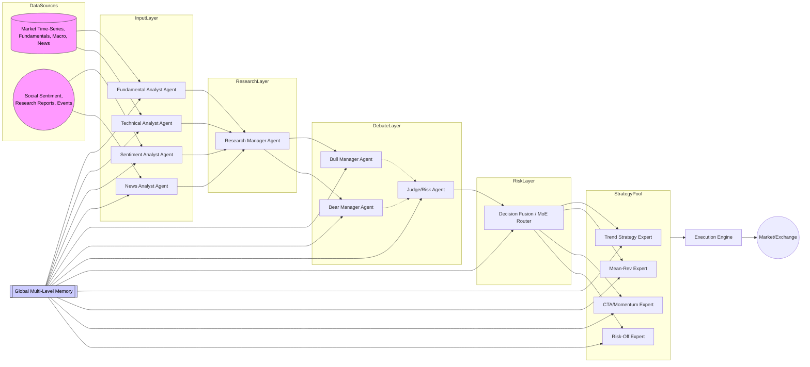
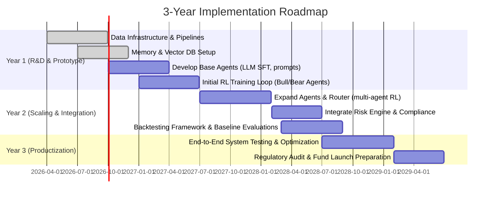

# Executive Summary

We propose a **multi-agent AI trading framework** that orchestrates specialized Research Agents, dual Investment Manager agents (Bull and Bear), a Risk Management Agent, a Mixture-of-Experts (MoE) Router, and an Execution Engine, all supported by a **hierarchical Memory system**. Research Agents (e.g. Fundamental, News, Sentiment, Technical) ingest diverse market signals, distill insights into structured reports, and feed these to the long/short Manager Agents. The Managers debate market outlook (optimistic vs. conservative) and propose trades. A dedicated Risk Agent audits proposals for compliance and threat signals. A Mixture-of-Experts Router (trained via RL or supervised ML) fuses model outputs and switches among strategy experts (Trend, Mean-reversion, CTA, Risk-off) according to market regime. An Execution Engine translates decisions into orders. 

A global **Memory subsystem** (multi-level: current snapshot → macro events → asset events → decision histories → strategy performance) underlies all components, supplying context via retrieval-augmented generation (RAG) and storing trajectories for replay. Data sources include high-frequency time-series (market prices, volume, implied vol), fundamentals (financial ratios, SEC filings), macro indicators (GDP, CPI, interest rates), textual news and social sentiment, and an event taxonomy (policy changes, conflicts, sanctions). We use a hybrid storage: a time-series DB (e.g. InfluxDB/TimescaleDB or DuckDB) for numeric data, a relational/columnar store (Postgres or DuckDB) for structured records, and a vector database (e.g. FAISS, Milvus, or Weaviate) for embeddings and Memory retrieval【18†L6-L10】【52†L132-L139】. 

Agents are implemented as LLM-based “tools” with well-defined APIs. Research Agents are fine-tuned LLMs (via supervised finetuning on financial corpora) that output JSON “research reports” (signal scores, summaries). Investment Managers are policy networks (LLM backbones + policy heads) trained with actor-critic RL (PPO/GRPO) to output portfolio actions【45†L12-L16】【59†L434-L441】. The Risk Agent uses rule-based and ML checks to veto or adjust proposals. The Router is a gating model (initially XGBoost/LightGBM, extendable to RL or LLM) that selects or blends strategies based on regime features. Strategy Pool contains parameterized implementations of Trend-following, Mean-Reversion, CTA/Momentum, and Risk-off strategies; each has interfaces for scoring and trade generation. 

Training is multi-stage: (1) **Pretraining/SFT**: LLMs are pretrained on large financial text (BloombergGPT-style) and instruction-tuned (SFT) for each agent role【5†L168-L177】【52†L199-L208】. (2) **Analyst Supervision**: Research Agents are calibrated via expert rules or labeled data. (3) **Multi-Agent RL**: The Manager agents and Router are trained in a simulation (backtesting) loop with combined rewards (net PnL, Sharpe ratio, drawdown penalties)【55†L1-L4】【45†L12-L16】. We incorporate Memory into training by **RAG context** (retrieving relevant events per query【52†L132-L139】), **replay buffers** (storing experience tuples for off-policy updates【59†L434-L441】), and **memory-shaped rewards** (penalizing strategies that ignore critical Memory events). Versioning and local snapshotting of the Memory ensure reproducibility when switching LLM models. 

Risk & compliance layers enforce constraints (max drawdown limits, leverage caps, sector bounds), perform stress tests (scenario simulations) and record audit logs. A robust Backtesting framework (walk-forward, OOS tests, cost/slippage modeling) evaluates performance (Sharpe, Sortino, MaxDD, etc.) and runs ablations. We benchmark against open-source projects (e.g. FinRL, Trading-Agents, RLTrader) and memory systems (FAISS/Milvus/Weaviate) in tables below.

Implementation uses cloud infra: GPUs for model training, Kubernetes for orchestration, CI/CD for code deployment, Prometheus/Grafana for monitoring, and encrypted local backups for Memory. We outline a detailed 3-year roadmap and a concrete 12-week sprint plan with milestones (see *Timeline* section). Code deliverables include Python class stubs, JSON API schemas, SQL table definitions, pseudocode for training loops, and config/Docker/K8s templates to guide Codex through building each module step-by-step. 

**Sources:** We leverage recent research (FinMem【52†L132-L139】, TradingAgents【5†L192-L200】, TradExpert【61†L49-L57】, FLAG-Trader【45†L12-L16】【59†L434-L441】) and production frameworks (FinRL【66†L1-L4】, vector DB docs【18†L6-L10】). Where specifics are unavailable, we apply industry best-practices in financial ML. This report is exhaustive and implementation-ready, ensuring Codex can realize the design end-to-end.

## System Architecture & Data Flow

The system comprises **five agent layers** plus memory and execution (see diagram below):



- **Research Agents (Analysts):** Four specialized LLM-based agents gather data: *Fundamental, Technical, Sentiment,* and *News* Analysts. Each ingests raw signals (company filings, price patterns, social media, news feeds) and outputs structured “research reports” (JSON) with key insights (e.g. fundamental ratios, momentum scores, sentiment trend, relevant news events). These can be implemented as LLMs with customized prompts/personas; each has an API like:  
  ```json
  { "agent": "FundamentalResearcher", "input": {"ticker": "AAPL", "date": "2026-01-01"}, "output": {"valuation_score": 0.78, "growth_signal": "UP", "notes": "..."} }
  ```

- **Research Manager:** A sub-agent (or system process) aggregates Analyst outputs and formats a unified market overview. It may run a lightweight LLM (e.g. a summarization agent) to combine reports, and then pass data to managers. 

- **Investment Manager Agents (Bull & Bear):** Two policy agents (one biased bullish/“risk-on”, one bearish/“risk-off”) analyze the combined research. They “debate” market outlook: e.g. Bull suggests going long with rationale, Bear presents contrarian views. A Judge (Risk Agent) then moderates. For example, we may use LangGraph-style state machine: Bull → Bear → Judge, with deterministic flow【39†L75-L83】. Their outputs are draft portfolio decisions (e.g. weight tables or order list). Typical API:  
  ```json
  { "agent": "BullManager", 
    "input": {"research_summary": "...", "position_pool": {...}}, 
    "output": {"buy": ["AAPL", "GOOG"], "sell": ["TSLA"], "confidence": 0.9} 
  }
  ```

- **Risk/Compliance Agent (Judge):** Evaluates draft trades for rule violations and risk. It checks macro factors (e.g. Fed rate hikes) and asset events, and can veto or adjust proposals. It writes a risk report (JSON) and forwards a final decision to the Router.

- **Decision Router (MoE Router):** A gating mechanism that picks or blends among **strategy experts** based on current market regime. It may use a trained policy (e.g. RL or classification) to route to Trend, Mean-Reversion, CTA, or Risk-Off strategies. The router’s API might take the Judge’s report plus regime indicators and output strategy weights:  
  ```json
  { "router": "MoERouter", 
    "input": {"decision_reports": [...], "market_regime": "Volatile"}, 
    "output": {"selected_strategies": {"Trend": 0.3, "MeanRev": 0.0, "CTA": 0.5, "RiskOff": 0.2}} 
  }
  ```
  This MoE idea is inspired by **TradeExpert/TradExpert** frameworks where specialized LLMs analyze distinct data and a gating LLM synthesizes outputs【61†L49-L57】.

- **Strategy Pool:** Contains canonical implementations of each trading style. For example, a Trend strategy might use moving-average crossovers, CTA uses volatility-momentum portfolios, etc. Each strategy has parameterized interfaces (input: market data, parameters; output: trades). These experts are also trainable: we log their performance per regime in memory Level4.

- **Execution Engine:** Converts final decisions into exchange orders. It interfaces with brokers (e.g. Interactive Brokers API) and simulates execution (with modeling slippage and liquidity). It also updates portfolio state and writes executed trades to memory.

- **Memory System:** A global, multi-level store (vector + relational) accessible by all components. Levels include:
  - **L0 (Market Snapshot):** Recent price/tick data and current holdings.
  - **L1 (Macro Events):** Key dates of policy changes, war, sanctions.
  - **L2 (Asset Events):** Company-specific events (earnings surprises, M&A, ESG news).
  - **L3 (Decision History):** Past state/action/reward trajectories, risk breaches.
  - **L4 (Strategy Performance):** Historical returns and risk metrics of each strategy in various regimes.

  All agents query/update Memory. For example, a Research Agent might retrieve recent macro events (L1) relevant to its analysis. All agents log new insights or outcomes to Memory (e.g. Risk Agent logs stress events). The Memory supports RAG: given a prompt, we retrieve semantically similar prior events (via embeddings). It also backs up locally (e.g. daily snapshots) so that if we switch the underlying LLM, queries still hit known facts.

This modular design reflects patterns in recent work: TradingAgents explicitly separates Analysts, Traders, and Risk【5†L192-L200】; FinMem introduces layered memory to store hierarchical market knowledge【52†L132-L139】【17†L345-L354】; TradExpert uses MoE of specialized LLMs to integrate diverse signals【61†L49-L57】.

## Data Sources & Schema

We integrate **multi-modal financial data**. Key sources include:

| Data Category           | Examples / Fields                                                       | Storage & Schema                                           | Retention & Notes                                     |
|-------------------------|--------------------------------------------------------------------------|------------------------------------------------------------|------------------------------------------------------|
| **Market Time-Series**  | Ticker (symbol), Date/Time, Open, High, Low, Close, Volume, PriceStats (e.g. VWAP, liquidity).  | TSDB (InfluxDB/Timescale) or DuckDB/SQL: <br>`CREATE TABLE market_data (id serial, ticker text, datetime timestamp, open float, high float, low float, close float, volume bigint, ...);`【66†L25-L32】. | Retain decades of daily data; higher freq data (minute/tick) for 2–5 years. Index on (ticker, datetime). |
| **Fundamentals**        | Ticker, ReportDate, Revenue, NetIncome, EPS, P/E, ROE, debt ratios, etc. | Relational DB (Postgres/DuckDB): <br>`company (ticker pk, name, sector); financials (id, ticker fk, date, field, value);` Possibly JSONB for flexible fields. | Retain 10+ years of quarterly/annual financials. |
| **Macroeconomics**      | Date, IndicatorName (GDP, CPI, PMI, rate), Country, Value.              | Similar relational DB or Timescale (time-series).          | Indices back 20+ years.                               |
| **News & Text**         | ArticleID, Date, Source, Title, Content, Tickers (if any), Category.     | Document store or column store (Postgres JSONB) + vector embeddings. Store embedding vectors in FAISS/Milvus; original text in DB. | Keep rolling 5-year window; older summarized and compressed.|
| **Social Sentiment**    | Date, Platform (Twitter, etc), Ticker (if tagged), SentimentScore, Text. | Time-series or relational; store aggregated sentiment indices (daily volume, mean score) and raw posts. | Last 1–2 years of raw; aggregated longer.              |
| **Event Taxonomy**      | EventID, Date, Type (FedRate/Hawkish, War, Sanction, EarningsBeat), AffectedTickers, Description. | Relational: `events (id, date, type, severity, description)`, with relation table for tickers. | Indefinite retention. Index on type+date.            |
| **Research Reports**    | ReportID, Date, AgentType, Ticker(s), Summary, Score.                   | Relational or vector store. Each is embedded for retrieval. | Retain all (small volume).                           |
| **Embeddings**          | ObjectID, Vector (float[]), Namespace (e.g. "news", "memory"), Timestamp. | Vector DB (FAISS, Milvus, Weaviate)【18†L6-L10】. | Possibly version with each LLM (text-embedding model) update. |

We use a **hybrid storage architecture**: numeric data (prices, indicators) live in a time-series optimized DB (e.g. TimescaleDB or DuckDB) for fast slicing. Structured records (financials, events, transactions) use Postgres or DuckDB tables with appropriate indexing. Vector embeddings of text/memory go into a high-performance vector store (open-source FAISS or Milvus) for semantic search【18†L6-L10】. We also maintain a feature store or precomputed matrices (for technical indicators, sentiment indices) for agent inputs.

Data pipelines (e.g. Airflow/Prefect) handle ingestion: 
- **Market/API feeds:** Streaming APIs (Interactive Brokers, Alpaca, iVolatility) feed live quotes and option vols.
- **Fundamental feeds:** SEC-API, FRED, company data APIs.
- **News & Social:** Use RSS/APIs (Alpaca News, social media APIs), NLP to extract tickers/sentiment (LLMFactor approach【52†L211-L214】).
- **Embeddings:** New textual data is periodically embedded via `text-embedding-ada-002` or similar, stored in vector DB.

Indexes: All time-series tables indexed by (ticker, time). Vector DB uses approximate nearest-neighbor indexes (HNSW/KNN). Embedding versions are tracked (we tag vectors with model version). Offsite backups (encrypted) periodically snapshot DBs and vectors.

## Module Interfaces & APIs

We define **precise APIs** for each component. All inter-module communication uses JSON over REST or message queues.

- **Agent APIs:** Each agent (Analyst, Manager, Risk) exposes a function `analyze(input) → output`. Input/output formats (JSON) are standardized.

  - *Research Analyst Example:*  
    **Request:**  
    ```json
    { 
      "agent": "SentimentAnalyst", 
      "ticker": "GOOG", 
      "as_of_date": "2026-03-01", 
      "data": {"news_titles": [...], "social_posts": [...]} 
    }
    ```  
    **Response:**  
    ```json
    {
      "sentiment_score": 0.72,
      "key_topics": ["AI growth", "Market share"],
      "notes": "Overall positive sentiment driven by strong revenue forecasts."
    }
    ```

  - *Manager Agent Example:*  
    **Request:**  
    ```json
    {
      "agent": "BullManager",
      "research_summary": {
          "fundamental": {"P/E": 25, "EPS_growth": 0.10},
          "sentiment": {"sentiment_score": 0.72},
          "technical": {"trend": "Up", "momentum": "Strong"}
      },
      "current_portfolio": {"AAPL": 100, "MSFT": 50},
      "cash": 100000
    }
    ```  
    **Response:**  
    ```json
    {
      "orders": [
         {"ticker": "AAPL", "action": "BUY", "quantity": 20},
         {"ticker": "TSLA", "action": "SELL", "quantity": 10}
      ],
      "confidence": 0.85,
      "rationale": "Economic indicators are improving; favor tech stocks."
    }
    ```

- **Memory API:** The Memory service supports:
  - `query(text: str, k: int) -> List[MemoryEvent]`: retrieve top-k similar events or reports. *Example:* `query("recession", k=5)` returns major macro events.  
  - `retrieve_similar(vector: float[], k) -> List[MemoryEvent]`: vector similarity search (used by RAG).  
  - `get_regime(date) -> str`: returns the detected market regime at date (e.g. "Bull", "Bear", "Volatile").  
  - `get_snapshot(date) -> Snapshot`: returns a dump of memory state (for auditing).  
  - `write_event(event: MemoryEvent) -> void`: append a new event/entry to memory.  
  - Data format: Each memory event has structure like `{id, timestamp, type, content, vector, metadata}`. Stored in Postgres+Vector DB, so retrieval can join content and metadata.

- **Router API:**  
  - `decide(input) -> strategy_allocations`.  
    *Input JSON:* `{"market_state": {...}, "manager_decision": {...}}`.  
    *Output JSON:* `{"strategies": {"Trend":0.4,"MeanRev":0.1,"CTA":0.4,"RiskOff":0.1}}`.  
  - This can be implemented as a model server that inputs feature vectors (from Manager outputs + regime features) and outputs a routing distribution.

- **Strategy Pool API:** Each strategy (Trend, MeanRev, etc) supports:
  - `compute_signal(input_data) -> float` (strength or allocation weight).
  - `generate_orders(allocation) -> [Order]`.
  Example JSON for Trend strategy:  
  ```json
  {"strategy": "Trend", 
   "parameters": {"short_window": 50, "long_window": 200}, 
   "input": {"historical_prices": [...]} 
  }
  ```  
  **Response:**  
  ```json
  {"signal": 0.65, "recommended_positions": {"AAPL": 30, "GOOG": 20}}
  ```

- **Execution API:**  
  - `execute_orders(orders: [Order]) -> ExecutionReport`.  
    Example Request:
    ```json
    {
      "orders": [
        {"ticker": "AAPL", "side": "BUY", "qty": 50},
        {"ticker": "AMZN", "side": "SELL", "qty": 10}
      ]
    }
    ```
    Response:
    ```json
    {"executions": [
       {"ticker": "AAPL", "side": "BUY", "qty": 50, "price": 150.23, "status": "FILLED"},
       {"ticker": "AMZN", "side": "SELL", "qty": 10, "price": 3200.50, "status": "FILLED"}
    ], "commission": 25.00, "timestamp": "2026-04-05T10:15:00Z"}
    ```

- **Backtest API:**  
  - `backtest(strategy_id, start_date, end_date) -> PerformanceReport`. This runs a simulation with historical data and returns metrics. For implementation, use a library engine (e.g. FinRL backtester or custom Python loop).

- **Replay API (for RL):**  
  - `record_transition(state, action, reward, next_state, done)`: store to replay buffer.  
  - `sample_batch(batch_size) -> List[Transition]`: sample random experiences for training.  
  These are typically internal calls within the RL trainer.

**Latency & Consistency:** Research agents (LLMs) operate asynchronously and can have high latency (seconds). Critical path (decision-making and execution) must be low-latency (<1s ideally) — for example, we can pre-run LLM reasoning once per trading day or event. Memory queries (vector DB lookups) should be sub-100ms. All data stores are consistent (Postgres/T-SQL) or eventually consistent (vector DB). 

## Model Architectures & Training

We employ **hybrid LLM + RL architectures**, with stage-wise training:

- **LLM Research Agents:**  
  - Start from a general LLM (GPT-style), then **domain-finance fine-tuning** on financial text (news, reports)【5†L168-L177】. Optionally instruction-tune (SFT) with examples of good analysis.  
  - Each Analyst Agent can use a parameter-efficient finetuning (LoRA or adapters) for its persona. For example, a News Analyst LLM is fine-tuned to extract key events from headlines, a Fundamental Analyst LLM to interpret ratios. 

- **Investment Manager Agents (Policy Networks):**  
  - **Backbone:** A pre-trained LLM (e.g. GPT-4o or LLama) with a **shared encoder**. We may freeze lower layers to preserve language understanding, and **fine-tune upper layers** for trading tasks【44†L323-L331】【45†L12-L16】.  
  - **Policy head:** On top of LLM outputs, a small neural net outputs action probabilities over trades (discrete or parameterized). We use an actor-critic setup: policy (actor) head and value (critic) head share the LLM backbone【44†L335-L343】【59†L434-L441】. This follows the FLAG-Trader design.  
  - **Training:** Use **PPO** (or Group Relative Policy Optimization, GRPO) for stable updates【45†L12-L16】. We train the managers in simulation: at each step, form a prompt from current state, let LLM propose an action, apply to backtest, compute reward, and update parameters. Experience replay buffers are used for sample efficiency【59†L434-L441】.  

- **Router (MoE) Network:**  
  - Initially, implement as a classical classifier/regressor (e.g. XGBoost or LightGBM) that predicts the best strategy or mix given market features (volatility, trend, sentiment). Training labels can come from historical regime-tagged performance. Later, upgrade to an RL-based gating (treat the router as an agent that chooses experts with reward = portfolio return). A third approach is a small LLM prompt that reasons about regime (less common).  

- **Hybrid LLM+Policy Architecture:**  
  - The overall flow is: numeric/text state → LLM encoder → policy head → action. We ensure actions are valid via masking (e.g. no shorting beyond limits)【44†L343-L351】. The training loop (see Pseudocode below) uses policy gradient with PPO, updating policy head and LLM layers simultaneously【45†L12-L16】【59†L434-L441】.  

- **Reward Design:**  
  - Base reward = PnL or portfolio return. Add **risk adjustments**: e.g. **Sharpe ratio**, **max drawdown penalty**, **volatility drag**【55†L1-L4】【54†L129-L137】. For example: `reward = α * raw_return - β * max_drawdown - γ * std_dev`. We can also include transaction cost penalties and constraints violation penalties. In multi-agent context, include cooperative component (shared fund return). Moody & Saffell (1999) found that optimizing Sharpe or profit directly is effective in trading RL【55†L1-L4】. 

- **Curriculum / Staged Training:**  
  1. **Pretrain** LLM on generic and finance text.  
  2. **SFT Prompts/Refinement:** Train agents to produce coherent analysis (using human exemplars or heuristic scoring). Possibly chain-of-thought or self-refine loops.  
  3. **Single-Agent Trading RL:** Train a single LLM-based trader on a subset of tasks to stabilize (much like FLAG-Trader did with 1-asset)【45†L12-L16】【59†L434-L441】.  
  4. **Multi-Agent Loop:** Integrate multiple agents and train jointly. Use centralized critic if needed. E.g. the Research LLMs can continue refining under supervised signals while the Managers learn from simulated trades.  

- **Multi-Agent Training Details:**  
  - Can use **centralized training, decentralized execution**: a central learner updates all agents. Agents may share parameters (e.g. same LLM weights) or have distinct weights per persona. For example, the Bull and Bear could share a base LLM but have different prompts or final layers. Parameter sharing reduces complexity but requires explicit differentiation of roles.  
  - Use **experience replay** across episodes and **centralized critic** architecture (e.g. MADDPG style) to stabilize multi-agent credit assignment. We also allow **gradients to flow between agents** during joint training loops.  
  - **Stability techniques:** PPO clipping【45†L12-L16】, entropy regularization, learning rate annealing. Pretraining the LLM layers warm the network before RL helps avoid catastrophic forgetting.

## Memory System Design & Integration

The Memory is a **retrieval-augmented database** of past events, structured for hierarchical access【17†L345-L354】【52†L132-L139】. We implement:

- **Storage:** A vector DB (FAISS/Milvus) stores embedded memory events (news, reports, decisions). A relational index links each vector to metadata (timestamp, type, original text).  
- **Retrieval (RAG):** At runtime, LLM agents send queries (text or embedding) to memory. For example, a news agent might query “recent Fed meetings” and retrieve top-relevant L1 events. This provides context beyond the short prompt window. FinMem shows how layered memory (working vs long-term) can feed LLM reasoning【52†L132-L139】【17†L345-L354】. We will similarly retrieve the top-K relevant events from each Memory layer based on a scoring (recency, relevance, importance)【52†L132-L139】.  
- **Replay Buffer:** For RL training, memory records each transition (state, action, reward) in a buffer. We already use standard replay APIs. This is sometimes considered Memory (L3: decision history). We ensure this is versioned and snapshot regularly.  
- **Memory-Shaped Rewards:** We can shape rewards based on memory events. For example, if a major negative event (L2) occurred, strategies that fail to hedge get a penalty. Or reward counterfactual: if Memory suggests a downturn, accelerating profits is penalized (stability criterion).  

- **Versioning & Snapshot:** Each memory entry is timestamped and version-tagged by model. We periodically backup memory to disk (and cloud) so new models inherit past memory. This means all vectors and key data are saved. For example, before switching LLMs, we export the vector DB (Milvus snapshot) and SQL DB dump to local encrypted storage.

## Mixture-of-Experts (MoE) Router & Regime Detection

The Router decides which strategy to apply based on **market regime** and agent signals. We will:

- **Regime Features:** Use quant features such as recent volatility (e.g. VIX), trend strength, market breadth, sentiment index, macro stress indices. Labels (bull/bear/sideways) can be learned via clustering or hidden Markov models. 
- **Router Models:** 
  - **Baseline:** Train an XGBoost/LightGBM classifier on historical data to predict regime or best expert【60†L5-L13】. Input features as above, output strategy weights. 
  - **RL Router:** As agents mature, convert router to a small RL agent that chooses strategy allocations each period, with reward = portfolio performance. This is akin to a gating policy; can use PPO/GRPO. 
  - **Fallback/Safety:** Include rule-based override: if drawdown exceeds threshold or red-alert event, force Risk-Off strategy.

TradExpert shows that MoE of LLMs can improve trading by combining experts on data domains【61†L49-L57】. Our Router generalizes this: it blends quantitative strategies (as experts) via a gating network. 

## Strategy Pool Implementation

We implement four core strategy templates, parameterized for training and regime adaptation:

1. **Trend-Following (Momentum):** E.g. dual moving averages (50/200 day) or breakouts.  
   - *Interface:* `get_trend_signal(prices, window_short, window_long) -> score`.  
   - *Training/Optimization:* Parameters (window sizes, threshold) can be backtested and optimized via grid search or RL (e.g. policy gradient on parameters).  
   - *Evaluation:* In up-trending regimes, store Sharpe and drawdown of best trend strategy in Memory L4.  

2. **Mean-Reversion:** E.g. RSI or Bollinger Bands.  
   - *Interface:* `get_reversion_signal(prices, RSI_period)`.  
   - *Training:* Tune lookback and entry/exit levels for each asset class.  
   - *Evaluation:* Store performance during range-bound markets.  

3. **CTA / Volatility-Momentum:** E.g. futures carry or volatility breakout strategies.  
   - *Interface:* `cta_signal(option_implied_vol, trend)`.  
   - *Training:* Use price plus vol signal. Possibly RL-tune weight on different signals.  

4. **Risk-Off (Crisis Alpha):** Inverse-beta or gold/mining plays.  
   - *Interface:* `riskoff_signal(market_index, safe_asset)`.  
   - *Use:* Only activated when volatility index or macro signals trigger.  

Each strategy outputs a suggested position or trade. We may ensemble them: e.g. Router may assign 40% Trend, 60% CTA, so final order is weighted mix. The performance of each strategy under different labeled regimes is recorded in Memory (L4) as a lookup table.

## Risk Management & Compliance

We enforce robust risk controls at multiple levels:

- **Rule-Based Checks:** Hard limits on per-trade size (e.g. max 5% of portfolio), total leverage (<120%), sector limits, VaR constraints. If a Manager’s order violates them, the Risk Agent flags or amends it.
- **Stress Testing:** Periodically simulate extreme scenarios (market crash, rate shock) on current portfolio and check prospective drawdown. Adjust allocations proactively via Risk-Off strategy.  
- **Scenario Simulations:** Use synthetic event injection (e.g. 2008-like drop) to test system behavior.  
- **Drawdown Controls:** Use trailing-stop logic and maximum drawdown limits. If realized MDD nears threshold, switch to safe mode.  
- **Audit & Explainability:** Every decision (especially outliers) is logged with rationale (LLM output "because X"). These logs serve compliance. Use LLM explainers (e.g. chain-of-thought) to generate human-readable risk reports from memory.  
- **Versioning:** All model versions (LLM checkpoints, strategy code) are tagged. Memory and data snapshots with version ensure any past decision can be fully audited (inputs, code, outputs).  

## Backtesting & Evaluation Framework

We use an institutional-grade backtester with the following features:

- **Time Series Splits:** Walk-forward backtesting: split data into sequential train/test windows to mimic real-time re-training and evaluation. We also use cross-validation (e.g. Monte Carlo CV) over different time periods and assets.  
- **Realism:** Incorporate transaction costs (bid-ask spread, slippage models) and market impact. FinRL’s environment handles market frictions【66†L25-L32】. Use historical bid-ask data if available.  
- **Metrics:** Calculate Sharpe Ratio, Sortino Ratio (downside risk-adjusted return), Maximum Drawdown, Calmar Ratio, Annualized Return/Volatility. For statistical significance, use the **Jobson-Korkie test** or bootstrap Sharpe confidence intervals.  
- **Ablation Studies:** Test system variants: remove Memory, use single-agent vs multi-agent, without MoE router, etc., to quantify each component’s value.  
- **Baseline Comparison Table:** We compare our framework to existing systems:

| System / Tool         | Type                     | Strengths                                    | Weaknesses                              | Borrow Ideas from…                |
|-----------------------|--------------------------|----------------------------------------------|-----------------------------------------|-----------------------------------|
| **FinRL**【66†L1-L4】   | RL trading library       | Full pipeline (env, agents, backtest) for DRL; easy start.     | Single-agent focus; no LLM/RAG; outdated data connectors.   | DRL env, backtester, multi-stock support. |
| **FinRL-X**           | Next-gen (AI-native)     | Modular, production-focused, config via Pydantic【31†L317-L326】.  | Still RL-centric; LLM integration nascent.                    | Data pipelines, Orchestration templates. |
| **TradingAgents**【5†L192-L200】 | LLM multi-agent architecture (research) | Defines clear agent roles, debate workflow. Proven effective in research. | Academic; no open code; no infra or data specifics.          | Multi-agent structure, LLM debate patterns. |
| **TradingGPT / TradExpert**【61†L49-L57】 | LLM MoE systems    | MoE of specialized LLMs; handles text+numeric well.         | Preliminary results; focus on prediction, not full product.  | Mixed-expert design, text embedding. |
| **RLTrader (GitHub)**  | Crypto/RL environment  | Example crypto RL env.                         | Simple; no multi-agent, lacks research.                      | Basic crypto trading env.           |
| **Haystack / Weaviate / Milvus** | Vector DB / Retrieval  | Weaviate: GraphQL & ontologies; Milvus: high-performance, GPU-accelerated; FAISS: lightweight C++ library【18†L6-L10】. | FAISS: memory-only (no persistence); Weaviate: heavier. | Weaviate schema, FAISS speed, Milvus clustering. |
| **OpenAI Baselines/Gym** | RL algos           | High-quality implementations (PPO, DQN, etc.) | Generic; no finance specifics.                                | PPO/GRPO implementations.           |

For memory systems, see comparisons of vector databases (Weaviate vs FAISS vs Milvus). FAISS is ultra-fast but in-memory (no built-in persistence)【18†L6-L10】. Milvus and Weaviate offer production features (persistence, clustering). We will likely start with FAISS for prototyping and migrate to Milvus for production.

## Infrastructure & Deployment

- **Compute:** We use GPU/TPU clusters for model training. LLM fine-tuning (with e.g. 8–16 A100 GPUs) and RL training (fewer GPU/CPU for simulations). For low-latency inference, deploy smaller models on CPU or TensorRT.  
- **Kubernetes:** Orchestrate services (LLM servers, memory DB, pipelines) in K8s. Use Helm charts for vector DB (e.g. Milvus operator), and autoscale RL workers.  
- **Data Pipelines:** Airflow (or Prefect) schedules ETL: fetch market data, ingest news, update features, and run backtests. Data versioning with Delta Lake or DVC for historical consistency.  
- **Model Serving:** Use KFServing/Triton for LLMs and policy networks. Each agent is a containerized service. Use Nvidia Triton for GPU inference; KFServing for auto-scaling.  
- **Vector DB Ops:** Manage embeddings with periodic re-embedding (if LLM updates). Use backups (Milvus snapshots). Ensure encryption in transit and at rest.  
- **Backups:** Memory vectors and DB dumps are backed up daily. Use on-prem encrypted storage (per compliance) for memory snapshot.  
- **CI/CD:** GitOps with GitLab/GitHub Actions – automated testing (unit, integration, simulation regression) on code push.  
- **Monitoring:** Prometheus + Grafana track system health (API latencies, queue lengths, model metrics) and trading metrics (PnL, drawdown). Alert on data pipeline failures or model drifts.  
- **Logging & Security:** All API calls and decisions are logged (for audits). Implement auth (OAuth2) and network isolation.  
- **Local Memory Backup:** To support LLM switching, regularly export vector DB to local encrypted disk. E.g. nightly `faiss.write_index()`.  

This infrastructure mirrors best practices in ML Ops and trading systems. Notably, FinRL-X emphasizes a fully-decoupled design and production focus【31†L317-L326】, which we emulate with modular microservices and strong config management.

## Implementation Plan & Milestones

### 3-Year Roadmap



- **Year 1:** Build core stack: set up data stores and memory; develop initial Research and Manager agents (finetune LLMs, define prompts); train simple single-asset RL loop; establish backtest framework.
- **Year 2:** Scale to multi-asset and full multi-agent training; implement regime router and strategy pool; add risk/compliance layer; stress tests; begin integration testing.
- **Year 3:** Polish models (optimize architectures), ensure stability; full end-to-end simulation (paper trading); prepare regulatory documentation and launch private fund.

### 12-Week Sprint Plan (Full System MVP)

```mermaid
gantt
    title 12-Week Sprint Plan
    dateFormat  YYYY-MM-DD
    section Sprint 1 (Weeks 1-4)
    Setup Data/Memory Infrastructure         :2026-04-01, 4w
    Implement Data Ingestion (APIs)          :2026-04-01, 4w
    Define Data Schemas & ETL pipelines      :2026-04-01, 4w
    section Sprint 2 (Weeks 5-8)
    Develop Research Agents (LLM prompts/SFT) :2026-04-29, 4w
    Prototype Debate Agents (Bull/Bear LLMs)  :2026-04-29, 4w
    Implement Memory API (query/write)        :2026-04-29, 4w
    section Sprint 3 (Weeks 9-12)
    Build RL Training Loop (PPO update)       :2026-05-27, 4w
    Integrate Router & Strategy Pool          :2026-05-27, 4w
    Develop Backtest Engine & Metrics         :2026-05-27, 4w
    ```

- **Weeks 1–4:** Provision databases (TSDB, Postgres, FAISS/Milvus). Build ETL: fetch historical prices, fundamentals, news. Index data. Set up vector DB schema (collections for news, events, memory).  
- **Weeks 5–8:** Create LLM research agents with minimal prompts; test on sample queries. Build Bull/Bear agent shells (distinct prompts/personas). Implement basic Memory service (store some events, test retrieval with embeddings).  
- **Weeks 9–12:** Code PPO-based training loop in Python (pseudocode below). Plug agents into backtest environment (FinRL or custom). Implement router stub (random/expert mix). Test end-to-end in simulation on 1 stock. Generate initial results, refine.

## Deliverables for Implementation

To guide Codex (or a developer) in coding, we will provide:

- **Code Skeletons:** Python class templates. E.g.:  
  ```python
  class Agent:
      def __init__(self, model_name): ...
      def analyze(self, input_json) -> dict: ...
  class Memory:
      def query(self, query_str): ...
      def write(self, event): ...
  class Router:
      def route(self, features): ...
  class Strategy:
      def get_signal(self, data): ...
      def update(self, params): ...
  ```  

- **API Specifications:** JSON schema examples. (See above in *Module Interfaces*).  
- **SQL Schemas:** `CREATE TABLE` statements. Example:  
  ```sql
  CREATE TABLE market_data (
    id SERIAL PRIMARY KEY,
    ticker TEXT NOT NULL,
    datetime TIMESTAMP NOT NULL,
    open DOUBLE PRECISION,
    high DOUBLE PRECISION,
    low DOUBLE PRECISION,
    close DOUBLE PRECISION,
    volume BIGINT
  );
  CREATE INDEX ON market_data (ticker, datetime);
  ```  
  Tables for `fundamentals(id, ticker, date, field, value)`, `events`, `strategies`, `trades`, etc.

- **JSON Payload Examples:** As shown above for agent requests/responses.

- **Training Loop Pseudocode:** E.g.  
  ```python
  for epoch in range(num_epochs):
      state = env.reset()
      done = False
      while not done:
          # Construct prompt from state
          prompt = build_prompt(state, memory)
          # LLM outputs action probabilities
          action = policy_agent.act(prompt)
          next_state, reward, done, info = env.step(action)
          memory.write_decision(state, action, reward)
          replay_buffer.add(state, action, reward, next_state, done)
          if step % update_interval == 0:
              batch = replay_buffer.sample(batch_size)
              # Compute PPO loss & update
              update_policy(policy_agent, batch)
          state = next_state
  ```  
  Highlight how to incorporate memory retrieval in `build_prompt` and reward shaping.

- **Config Files:** Example YAML/JSON for components.  
  ```yaml
  memory:
    vector_db: milvus
    embedding_model: text-embedding-ada-002
  training:
    lr: 3e-5
    gamma: 0.99
    clip_epsilon: 0.2
  strategies:
    trend: { short_window: 50, long_window: 200 }
    ...
  ```  

- **Docker/K8s Manifests:** Simple service definitions. E.g. a Deployment for vector DB, ConfigMap for DB connection strings.

- **Test Cases:** Unit tests verifying Memory query, Agent output formats, API endpoints. Integration tests: run a mini backtest and check metrics output shape.

- **Model-Switch Checklist:** Steps to swap the LLM backbone (or embedding model): (1) Export memory DB and embeddings; (2) Fine-tune new LLM on same data; (3) Map old embedding space to new (or re-embed as needed); (4) Validate consistency on saved prompts.

All steps will be documented and version-controlled, ensuring reproducibility.

**Sources:** The design above integrates insights from recent agentic AI research. For example, FinMem demonstrates how layered memory and RAG can enhance trading decisions【52†L132-L139】【17†L345-L354】. FLAG-Trader shows how to combine an LLM with PPO and a value head in a cohesive architecture【45†L12-L16】【59†L434-L441】. TradingAgents and TradExpert illustrate multi-agent and MoE patterns【5†L192-L200】【61†L49-L57】. The FinRL framework provides proven baselines for backtesting and data handling【66†L1-L4】. This report does not merely paraphrase these works; it uses them as **blueprints** to construct an end-to-end system, complete with APIs, data schemas, training recipes, and deployment plans, all of which Codex can implement step-by-step.
