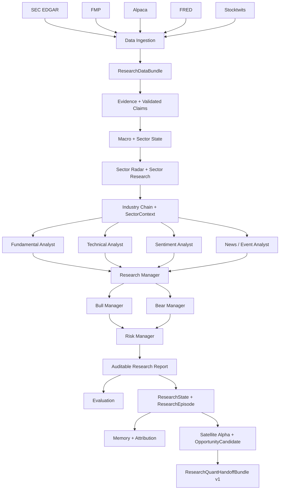

# DeepInsight

> **Institutional-grade AI research, grounded in evidence.**

DeepInsight is an evidence-grounded multi-agent AI investment research system
designed to turn fragmented market, fundamental, macro, news, and sentiment
data into auditable institutional-style research.

It is not a stock-picking chatbot, and it does not ask an LLM to guess financial
numbers. DeepInsight builds a canonical research dataset first, validates every
accepted factual claim against Evidence, and then uses specialized Agents for
interpretation, debate, risk reasoning, and report synthesis.

- Multi-source financial intelligence
- Eight-agent research organization
- Evidence-grounded and numerically validated claims
- Point-in-time-safe data and Memory boundaries
- Auditable Markdown and JSON research reports
- Macro, Sector, Radar, and Industry-Chain intelligence
- Deterministic ResearchState, Episode, Attribution, and PIT datasets
- Satellite Alpha research descriptors and a versioned Research-to-Quant handoff

The current release is **DeepInsight Phase 4 — Research Intelligence v1**. It
produces an evidence-grounded human Research Report and deterministic,
PIT-safe machine research artifacts through `ResearchQuantHandoffBundle v1`.

DeepInsight is the Research Intelligence layer. Quant Factor processing,
IC/RankIC, Top-K selection, trading timing, Regime/MoE, portfolio construction,
positions, orders, and execution belong to a future independent
`deepinsight-quant` system and are not implemented here.

## How it works



The deterministic layer computes and normalizes financial values before model
inference. LLMs are responsible for interpretation, synthesis, debate, and risk
reasoning—not raw financial arithmetic.

The authoritative fact flow is:

```text
Multi-source Data
→ Canonical Research Data
→ Evidence
→ Validated Claims
→ Macro / Sector / Radar / Industry Chain Context
→ Eight-Agent Research
→ Research Report + ResearchState + ResearchEpisode
→ Satellite Alpha Observation + OpportunityCandidate
→ ResearchQuantHandoffBundle v1
```

## Phase 4 at a glance

| Layer | Delivered capability | Contract boundary |
|---|---|---|
| Phase 4A — Sector Intelligence | Macro, Sector State, Radar, Sector Research, Industry Chain, SectorContext-to-Agent propagation | Accepted Sector Claims and Events remain Evidence-grounded and PIT-safe |
| Phase 4B — Structured Research | Unified Temporal Contract, ResearchState, ResearchEpisode, Learning Memory, Attribution, PIT Dataset, Golden Replay | Historical identity is deterministic; replay performs zero Provider and LLM calls |
| Phase 4C — Research-to-Quant Foundation | Satellite Alpha descriptors, OpportunityCandidate, State transitions, ResearchQuantHandoff | Research descriptors only—no rank, z-score, trading decision, or position |

The full real-Provider AAPL live acceptance and final independent audit both
passed. The recommended release tag is
`phase4-research-intelligence-v1`. See the
[Phase 4 release notes](docs/releases/PHASE4_RESEARCH_INTELLIGENCE_V1.md) for
the accepted scope, limitations, artifact policy, and product backlog.

### Research / Quant boundary

```text
Raw Evidence
→ Validated Claim
→ Research State Feature
→ Satellite Alpha Observation
→ ResearchQuantHandoffBundle v1
──────────────── Research repository boundary ────────────────
→ future deepinsight-quant
→ Processed Factor Exposure
→ Alpha Signal
→ Strategy
→ Portfolio
```

`Planetary Alpha` means traditional, repeatable quantitative Factors computed
across a broad PIT market universe. It belongs to future `deepinsight-quant`.
`Satellite Alpha` means attributable descriptors produced by this Research
system. A Satellite observation may be categorical, numeric and grounded, or a
structured component set; it is never silently replaced by an opaque stock
score.

## Research capabilities

### Fundamental intelligence

- Revenue and net-income growth
- Gross, operating, and net margins
- ROE and ROA
- Liquidity and leverage
- EPS TTM and book value per share
- Market capitalization, P/E, P/B, and earnings yield

### Technical intelligence

- Multi-window returns and simple moving averages
- RSI, MACD, and ATR
- Realized volatility and maximum drawdown
- Volume ratio
- Relative strength versus SPY, QQQ, and XLK

### Macro intelligence

- Rates and yield-curve context
- Inflation
- Labor conditions
- Growth and industrial production
- Financial stress

### Sentiment intelligence

- Community sentiment and bullish/bearish distribution
- Attention and message volume
- Sentiment change
- Raw community messages retained as supporting Evidence, not verified facts

### News and events

- SEC filings and corporate events
- Alpaca financial news
- Point-in-time event lineage and source references

### Sector and Industry-Chain intelligence

- Versioned Sector ontology and PIT membership
- Sector State and Macro context
- Radar anomaly and Event detection
- Claim-first Sector Research with mandatory material-Event coverage
- Industry-Chain membership and accepted-Claim propagation
- Role-specific SectorContext projection into all eight asset Agents

### Structured research intelligence

- Deterministic `ResearchStateSnapshot` semantic identity
- `ResearchEpisode` run, Agent, Claim, and model lineage
- L0–L4 Learning Memory lifecycle with PIT-safe retrieval
- Research Attribution across Context, Agent, Claim, Evidence, Radar, and Memory
- PIT dataset samples and versioned Golden Replay manifests
- Frozen-artifact reconstruction without Provider or LLM calls

### Satellite Alpha and Research-to-Quant handoff

Satellite Alpha means proprietary Research descriptors derived from accepted
Evidence, Claims, ResearchState, Sector/Chain reasoning, events, debate, risk,
and Memory. It supports `SELECTION`, `TIMING`, or `BOTH`, but is not a validated
Quant Factor exposure or trading signal.

- Seven Selection descriptor families with explicit coverage and missingness
- Research opportunity representation through `OpportunityCandidate`
- Deterministic `ResearchStateTransition` and Timing descriptor contracts
- Compact, versioned `ResearchQuantHandoffBundle v1`
- JSON/JSONL external-consumer support with canonical
  `(asset_id, research_as_of)` batch identity
- Positive, negative, partial, missing, and history-insufficient samples

Missing is never converted to zero. `PARTIAL`, `MISSING_INPUT`,
`NOT_AVAILABLE_AT_SOURCE_RUN`, `REQUIRES_HISTORY`, and `UNSUPPORTED` remain
explicit contract states.

## Data sources

| Provider | Capability | Current role |
|---|---|---|
| SEC EDGAR | Filings, XBRL facts, corporate events | Authoritative filing and disclosure source |
| Financial Modeling Prep | Standardized US fundamentals, TTM ratios, valuation | Primary standardized-metric source; disabled unless configured |
| Alpaca Market Data | OHLCV, benchmarks, financial news | Primary price, market/sector context, and news source |
| FRED / ALFRED | Macroeconomic observations and vintages | Point-in-time macro source |
| Stocktwits MCP | Community sentiment and attention | Sentiment Evidence; not treated as verified company fact |
| Qwen | Structured LLM inference and evaluation | Current production live LLM through the shared `LLMGateway` |

Several live Providers require credentials from the user's own accounts. No
credential value belongs in the repository.

## The eight-agent research organization

1. **Fundamental Analyst** — growth, profitability, balance sheet, and valuation
2. **Technical Analyst** — trend, momentum, volatility, volume, and relative strength
3. **Sentiment Analyst** — community positioning, attention, and disagreement
4. **News/Event Analyst** — filings, corporate events, and financial news
5. **Research Manager** — integrates the four Analyst claim sets
6. **Bull Manager** — constructs the evidence-supported upside thesis
7. **Bear Manager** — constructs the evidence-supported downside thesis
8. **Risk Manager** — reviews macro, event, market, and thesis risks

Managers consume validated upstream claims; they do not reconnect to Providers
or independently fetch facts. Agents never depend directly on DuckDB, FAISS, or
a Provider SDK.

## Evidence grounding

Every accepted factual claim retains provenance to canonical Evidence. Numeric
claims require either an exact source literal or a deterministic feature
calculation. Unknown citations, unsupported numbers, and prohibited claim
intents are quarantined and cannot enter managers or reports.

DeepInsight deliberately prefers an explicit gap over an invented completion:
if a fact cannot be validated, it is rejected or disclosed as missing.

## Point-in-time safety

Each live run freezes one exact timezone-aware UTC `research_as_of`. Providers
first interpret that cutoff in their native timezone, calendar, and precision,
then normalize eligible source information back onto the canonical UTC
timeline. A market session date, FRED local date, or fiscal period never
replaces the global research instant.

Only information available by the cutoff is eligible. Live `ingested_at`
records acquisition lineage; historical replay additionally preserves the
stricter original-observed ingestion boundary. This Unified Temporal Contract
protects ResearchState, Episode, Memory, Satellite, and Handoff artifacts from
future leakage.

## Phase 4 validation snapshot

Research Intelligence v1 passed a complete real US:AAPL release acceptance:

| Check | Result |
|---|---:|
| Default pytest | 751 passed, 5 live tests deselected |
| Leakage regression | 8 passed |
| Real Providers | SEC, FMP, Alpaca Market/News, FRED/ALFRED, Stocktwits |
| Qwen generation / embedding | Real / PASS |
| Eight asset Agents | 8/8 completed |
| Human Report claims | 68 |
| Numeric claims grounded | 47/47 |
| Unique citations traced | 82/82 |
| Invalid citations | 0 |
| Future leakage | 0 |
| Overall report evaluation | 0.9567 |
| Phase 4A Sector/Chain surfacing | PASS |
| Phase 4B State/Episode/Attribution | PASS |
| Phase 4C Satellite/Candidate/Handoff | PASS |
| External Handoff consumer | PASS |

The accepted run produced a human Report, ResearchState, ResearchEpisode,
Attribution, seven Selection and seven Timing observations,
OpportunityCandidate, ResearchStateTransition, and ResearchQuantHandoff.
Memory retrieval was honestly `EMPTY_VALID`; current live Timing descriptor
values remained `MISSING_INPUT`. Neither result is presented as validated
predictive Alpha.

## Phase 3 validation snapshot

Research Completeness v1 was frozen on the real US:AAPL acceptance run
`20260814T100747Z`:

| Check | Result |
|---|---:|
| Default pytest | 447 passed, 5 live tests deselected |
| Eight Agents | 8/8 completed |
| Accepted Agent claims | 54 |
| Rejected claims | 2, quarantined |
| Unique citations traced | 56/56 |
| Citation coverage | 1.00 |
| Citation traceability | 1.00 |
| Numeric grounding | 1.00 |
| Factual correctness | 0.97 |
| Trading-instruction compliance | 1.00 |
| Overall report evaluation | 0.9675 |

Phase 3 remains the apples-to-apples historical baseline. It is one live
**research-quality acceptance** using real SEC, FMP, Alpaca,
FRED, Stocktwits, and Qwen services. It is not an investment-return result,
trading benchmark, or statement of future performance.

## Phase 4 output

The accepted AAPL research product combines:

- a standardized growth, margin, profitability, liquidity, and valuation snapshot;
- rates, inflation, labor, growth, and financial-stress context;
- S03 Consumer Electronics Sector state, catalysts, and risks;
- `APPLE_CHAIN` context with accepted Claim propagation into the asset thesis;
- Radar Events connected to Sector, Chain, and asset implications where material;
- trend, momentum, volatility, volume, drawdown, and benchmark-relative strength;
- aggregate community sentiment and attributable financial news;
- separate Bull, Bear, Risk, and final synthesis sections;
- deterministic State, Episode, Attribution, Satellite, Candidate, Transition,
  and Handoff artifacts for machine consumption.

Local live artifacts are written to a timestamped, Git-ignored directory:

```text
data/live_acceptance/phase4_prefreeze/<run_id>_aapl/
├── acceptance_summary.json
├── provider_temporal_freshness_summary.json
├── provider_request_budget.json
├── sector_state / sector_macro / sector_radar
├── sector_research / SectorContext
├── final_report
├── ResearchState / ResearchEpisode / Attribution
├── Satellite observations / OpportunityCandidate / Transition
├── ResearchQuantHandoff
└── phase3_comparison.json / phase3_comparison.md
```

Generated acceptance data is evidence for a local run and is not intended for
source control. Compact deterministic Golden Replay and regression JSON
artifacts are versioned separately under `data/golden_replay/` and the
Day38–Day42 artifact directories.

## Installation

DeepInsight targets Ubuntu and Python 3.12. Conda provides the interpreter;
`uv` resolves and installs dependencies from the sole dependency declaration,
`pyproject.toml`. The project does not create an in-repository `.venv`.

```bash
conda env create --file environment.yml
conda activate deepinsight
uv pip install --python "$CONDA_PREFIX/bin/python" -e ".[dev]"
```

To create the environment without `environment.yml`:

```bash
conda create -n deepinsight python=3.12 pip -y
conda activate deepinsight
python -m pip install uv
uv pip install --python "$CONDA_PREFIX/bin/python" -e ".[dev]"
```

## Configuration

[`src/core/settings.py`](src/core/settings.py) is the typed configuration source.
The application reads environment variables only; it does not load `.env`
files. [`.env.example`](.env.example) is a name-and-default reference, not a
credential store.

Prepare a private shell script outside the repository:

```bash
chmod 600 ~/.local/bin/load_deepinsight_keys.sh
source ~/.local/bin/load_deepinsight_keys.sh
```

Core live variables:

| Variable | Required for |
|---|---|
| `DEEPINSIGHT_LLM_PROVIDER=qwen` | Selecting the production Qwen path |
| `QWEN_API_KEY` | Qwen inference and evaluation |
| `QWEN_MODEL_NAME` | Qwen model selection; current default is `qwen3.7-flash` |
| `DEEPINSIGHT_PROVIDER_SEC_USER_AGENT` | SEC Fair Access identity |
| `DEEPINSIGHT_PROVIDER_SEC_CIK_MAP` | Canonical asset-to-CIK mapping |
| `APCA_API_KEY_ID`, `APCA_API_SECRET_KEY` | Alpaca data and news |
| `FRED_API_KEY` | FRED/ALFRED macro data |
| `STOCKTWITS_MCP_ENABLED=true` | Explicit Stocktwits MCP enablement |
| `FMP_ENABLED=true`, `FMP_API_KEY` | FMP standardized metrics |
| `DEEPINSIGHT_LIVE_*` | Versioned live dataset, cutoff, window, and output root |

Stocktwits authorization state is stored under the configured local
`STOCKTWITS_MCP_TOKEN_STORE`, which is ignored by Git. Never display, attach,
or commit the private loader, OAuth state, or any secret.

## Quick start

### Offline API demo

The deterministic offline path requires no external credentials:

```bash
"$CONDA_PREFIX/bin/python" -m uvicorn apps.api.offline_main:app \
  --host 127.0.0.1 --port 8001
```

Health check:

```bash
curl --fail http://127.0.0.1:8001/health
```

Submit the fixed offline single-asset workflow through the same public API
contract used by production composition:

```bash
curl --fail \
  -H "Content-Type: application/json" \
  -d '{
    "report_date": "2026-08-14",
    "market_scope": "US",
    "report_type": "single_asset",
    "asset_ids": ["US:AAPL"],
    "language": "en",
    "include_sections": [
      "executive_view", "macro_context", "fundamentals",
      "technical_text", "sentiment", "news_events",
      "bull_case", "bear_case", "risk_review", "final_synthesis"
    ],
    "force_refresh": false
  }' \
  http://127.0.0.1:8001/v1/reports/generate
```

The production application factory is available separately and requires its
configured DuckDB/FAISS/Redis and live Provider environment:

```bash
"$CONDA_PREFIX/bin/python" -m uvicorn \
  apps.api.production:create_production_application --factory \
  --host 127.0.0.1 --port 8000
```

Routes delegate to injected application services; they do not call databases,
vector indexes, or LLM Providers directly. See [API documentation](docs/api.md)
for the complete contract.

### Live provider smokes

After sourcing the private shell environment, each smoke remains explicit and
outside default pytest:

```bash
"$CONDA_PREFIX/bin/python" -m scripts.smoke_sec_edgar
"$CONDA_PREFIX/bin/python" -m scripts.smoke_alpaca
"$CONDA_PREFIX/bin/python" -m scripts.smoke_fred
STOCKTWITS_MCP_ENABLED=true \
  "$CONDA_PREFIX/bin/python" -m scripts.smoke_stocktwits
FMP_ENABLED=true \
  "$CONDA_PREFIX/bin/python" -m scripts.smoke_fmp
DEEPINSIGHT_LLM_PROVIDER=qwen \
  "$CONDA_PREFIX/bin/python" -m scripts.smoke_qwen --diagnostic
```

### Reproducible live report

`scripts.live_report` is fail-closed: every required Provider, Qwen Judge, and
dataset field must be configured, and no Fake fallback is allowed.

Run the configuration-only preflight first. It performs zero Provider data
requests; in particular, do not run `scripts.smoke_fmp` immediately before the
full acceptance because that command is a complete four-endpoint acquisition.

```bash
FMP_ENABLED=true STOCKTWITS_MCP_ENABLED=true \
  "$CONDA_PREFIX/bin/python" -m scripts.live_report --configuration-preflight
```

The following full command owns the run's single authoritative FMP
acquisition, validates the resulting run-scoped snapshot, and reuses it during
formal ingestion.

```bash
source ~/.local/bin/load_deepinsight_keys.sh
env -u ALL_PROXY -u all_proxy \
  DEEPINSIGHT_LLM_PROVIDER=qwen \
  FMP_ENABLED=true \
  STOCKTWITS_MCP_ENABLED=true \
  DEEPINSIGHT_LIVE_DATASET_VERSION=live_aapl_release_v1 \
  DEEPINSIGHT_LIVE_AS_OF_DATE=YYYY-MM-DD \
  DEEPINSIGHT_LIVE_DATA_START=YYYY-MM-DD \
  DEEPINSIGHT_LIVE_DATA_END=YYYY-MM-DD \
  "$CONDA_PREFIX/bin/python" -m scripts.live_report
```

Choose a closed, internally consistent window where
`data_start <= data_end <= as_of_date`. The command creates a new timestamped
directory unless `DEEPINSIGHT_LIVE_ROOT` explicitly selects a new empty root.

## Quality gates

Default tests are deterministic, offline, and exclude the `live` marker:

```bash
"$CONDA_PREFIX/bin/python" -m pytest -q
"$CONDA_PREFIX/bin/python" -m ruff check .
"$CONDA_PREFIX/bin/python" -m mypy .
"$CONDA_PREFIX/bin/python" -m black --check .
git diff --check
```

The offline research benchmark is also deterministic:

```bash
"$CONDA_PREFIX/bin/python" -m pytest \
  tests/integration/benchmark -q
```

## Repository structure

```text
apps/                    API, Worker, Scheduler, and Web composition roots
config/                  Provider metadata, prompts, and evaluation rules
src/
├── adapters/            External Provider boundaries
├── agents/              Eight-agent and Sector Research contracts
├── benchmark/           Offline benchmark runner
├── evaluation/          Deterministic and LLM-Judge evaluation
├── memory/              Point-in-time L0–L4 Research Memory
├── operators/           Financial, Macro, Sector State, and Radar operators
├── repositories/        DuckDB and FAISS persistence boundaries
├── reports/             Report contracts and assembly
├── schemas/             State, Episode, Satellite, Transition, and Handoff contracts
└── services/            Ingestion, Gateway, replay, State, and handoff services
scripts/                 Explicit operations and live-smoke entry points
tests/                   Offline unit/integration tests and isolated live tests
docs/                    Specifications, decisions, tasks, releases, and operations
```

## Roadmap

- **Phase 1 — Research Operating System Foundation:** done
- **Phase 2 — Evaluation, Benchmark, and Real Data Validation:** done
- **Phase 3 — Research Completeness v1:** done and frozen
- **Phase 4A — Sector Intelligence:** done and frozen
- **Phase 4B — Structured Research Intelligence:** done and frozen
- **Phase 4C — Research-to-Quant Satellite Alpha Foundation:** done and frozen
- **Future `deepinsight-quant`:** independent Base PIT Universe, Planetary
  Alpha, Factor processing and validation, IC/RankIC, selection, timing,
  Holdings, Regime/MoE, backtesting, portfolio, risk, and execution

DeepInsight stops at `ResearchQuantHandoffBundle v1`. OpportunityCandidate is a
Research opportunity object—not a BUY recommendation, Top-K result, or
portfolio instruction.

## Documentation

- [Master specification](docs/MASTER_SPEC.md)
- [Coding guide](docs/CODING_GUIDE.md)
- [Module status](docs/MODULE_STATUS.md)
- [Architecture decisions](docs/DECISIONS.md)
- [Schema reference](docs/schema.md)
- [Operations guide](docs/operations.md)
- [Satellite Alpha contract](docs/SATELLITE_ALPHA.md)
- [OpportunityCandidate contract](docs/OPPORTUNITY_CANDIDATE.md)
- [ResearchStateTransition contract](docs/RESEARCH_STATE_TRANSITION.md)
- [Research-to-Quant handoff](docs/RESEARCH_QUANT_HANDOFF.md)
- [Phase 4 release notes](docs/releases/PHASE4_RESEARCH_INTELLIGENCE_V1.md)
- [Phase 3 release notes](docs/releases/PHASE3_RESEARCH_COMPLETENESS_V1.md)
- [Phase 3 founder roadshow (Chinese)](docs/roadshow/DEEPINSIGHT_PHASE3_ROADSHOW_CN.md)

## Disclaimer

DeepInsight is currently a research system. It does not provide investment
advice, portfolio allocation, or trade execution.
