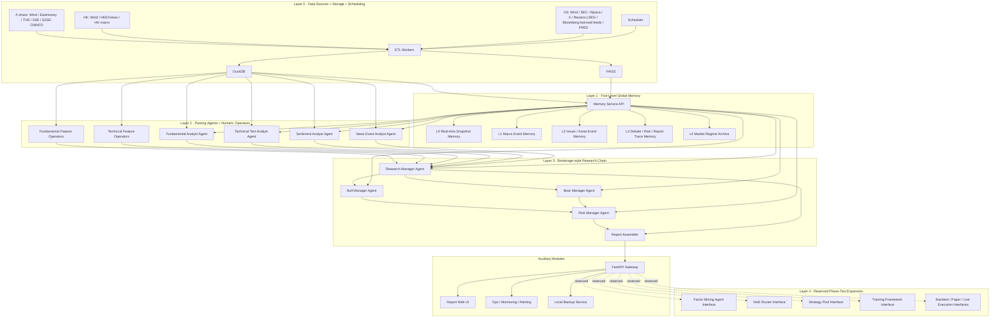

# System Engineering Specification for a Multi-Market AI Investment Research Platform

## Phase 4C Architecture Governance Addendum — Research / Quant Boundary

This addendum is the current authority for ownership beyond Phase 4B. Where
older sections reserve phase-two factor, router, strategy, backtest, training,
portfolio, or execution runtime inside this repository, those reservations are
superseded by this boundary. Historical interfaces and nullable `p2_*` fields
remain non-operational compatibility artifacts; they do not authorize new
runtime implementation in `deepinsight`.

DeepInsight's long-term architecture has three layers:

| Layer | System ownership | Responsibility |
|---|---|---|
| Research Intelligence | current `deepinsight` repository | Evidence, research understanding, opportunity discovery, structured research descriptors, and Research-to-Quant handoff |
| Quant Alpha / Strategy | future `deepinsight-quant` repository | broad PIT universe, Factor processing/validation, selection, timing, Regime/MoE routing, strategy, and backtest |
| Portfolio / Execution | future `deepinsight-quant` repository | holdings ranking/decay, portfolio optimization, position sizing, orders, and execution simulation/runtime |

The governing principle is: AI understands markets and discovers
opportunities; Quant measures Alpha and performs selection, timing, portfolio,
and risk transforms; the Portfolio Engine converts validated predictions into
executable positions. The current repository stops before Quant processing.

### Current repository responsibilities

`deepinsight` owns raw information mining; SEC/FMP/Alpaca/FRED/news/sentiment
Evidence; Macro, Sector, and Industry-Chain research; Radar/anomaly detection;
multi-Agent research and Bull/Bear/Risk debate; ResearchState;
ResearchEpisode; Learning Memory; Research Attribution; Opportunity Candidate
generation; proprietary Research Features; raw Satellite Alpha descriptors;
and `ResearchQuantHandoffBundle` production.

It does not own a broad-market traditional Factor library, quantitative
universe maintenance, winsorization, neutralization, z-score exposures,
IC/RankIC/ICIR, Factor portfolios/weights, Alpha Models, Quant Top-K, timing
rules, Holdings Top-K/decay, trading Regime/MoE routing, portfolio optimization,
position sizing, order generation, backtesting, execution, or live trading.

### Planetary Alpha / 行星阿尔法

Planetary Alpha is a traditional Quant Alpha/Factor that can be computed
cheaply, stably, and repeatedly over a large point-in-time market universe
from standardized market/fundamental data and versioned quantitative
transforms. Typical families are Momentum, Reversal, Value, Quality, Growth,
Size, Volatility, Liquidity, Technical, Fundamental revisions, and traditional
event factors. Broker factor libraries, market/fundamental data, and standard
Quant transforms are its primary future sources. Planetary Alpha belongs to
`deepinsight-quant`; this repository may name the concept but may not implement
its formal Factor library.

### Satellite Alpha / 卫星阿尔法

Satellite Alpha is a proprietary structured research descriptor produced by
DeepInsight Research Intelligence through information mining, Macro/Sector/
Industry-Chain reasoning, event interpretation, fundamental expectation
change, research debate, risk analysis, ResearchState, and Memory. Within this
repository it is not a validated quantitative Factor exposure. Only after a
future Quant pipeline performs cross-sectional/time-series processing,
normalization, neutralization, standardization, Factor validation, and
incremental-Alpha evaluation may it become a Quant Factor/Alpha exposure.

The fixed boundary pipeline is:

```text
Raw Evidence
↓
Validated Claim
↓
Research State Feature
↓
Satellite Alpha Observation
↓
ResearchQuantHandoffBundle
↓
future deepinsight-quant
↓
Processed Factor Exposure
↓
Alpha Signal
↓
Strategy
↓
Portfolio
```

This repository may produce only through `ResearchQuantHandoffBundle`. It must
not produce `quant_factor_zscore`, `neutralized_factor`, IC, `BUY_SCORE`,
`SELL_SCORE`, `trade_signal`, `position_score`, `position_weight`, or orders.
Satellite descriptors support `SELECTION`, `TIMING`, or `BOTH` intent.

Selection descriptors answer which issuers deserve expensive Research
Coverage at the same cutoff—using decomposed concepts such as business-binding
depth, revenue exposure, earnings-increment potential, Evidence quality,
Sector/Chain alignment, Bull/Bear disagreement, catalyst quality, and risk
burden. Quant performs cross-sectional processing and ranking. Timing
descriptors describe how one Asset's own State changed—expectation revision
velocity, risk escalation, thesis transition, Evidence confirmation, event
window, or catalyst proximity. Quant decides whether those changes imply
entry, exit, or sizing.

Do not collapse these descriptors into one opaque `AI_STOCK_SCORE`. Prefer
structured components and categorical states such as
`logic_stage = ORDER_CONFIRMED`; any later numeric mapping is versioned and
owned by Quant.

### Future selection, timing, and holdings architecture

```text
Base Quant PIT Universe
├── Planetary Alpha cheap scan
└── DeepInsight Opportunity Discovery
        ↓
Candidate Universe
        ↓
expensive AI research
        ↓
Planetary + Satellite Alpha processing in deepinsight-quant
        ↓
Top-K Research Coverage Pool
```

Research Candidate selection never replaces the independent, complete Base PIT
Market Universe used for Planetary Alpha research, Factor validation, and
cross-sectional comparison. Future timing operates only in
`deepinsight-quant` over Planetary time-series factors, Satellite timing
descriptors, and future Regime/MoE context. Future Holdings is a separate
Top-K system over current holdings and the current Research Coverage Pool;
performance, potential, Alpha, risk, and time decay affect ranking, while the
future all-weather/MoE strategy system owns rebalance frequency. None of these
systems is implemented in this repository.

Day44 froze ownership. Day45–47 implement deterministic, PIT-safe
`SatelliteAlphaDefinition`/`SatelliteAlphaObservation`,
`OpportunityCandidate`, and `ResearchStateTransition` over frozen Research
artifacts. Day48 implements `ResearchQuantHandoffBundle v1` as the sole
versioned, reference-only Research export plus canonical JSON/JSONL artifacts.
It may carry qualified, insufficient, partial, negative, or history-missing
Research; it performs no Quant processing. Existing ValidatedClaim grounding,
ResearchState/ResearchEpisode identities, Unified Temporal Contract, and
Golden Replay behavior remain unchanged.

### Legacy planning classification

| Class | Existing concept | Day44 disposition |
|---|---|---|
| A — rename/reframe | ResearchState features, proprietary event/Sector/Macro/Memory descriptors, research hints | Research Feature or raw Satellite Alpha; retain Evidence/PIT lineage and no Quant semantics |
| B — migrate ownership | Factor Miner/Registry/Evaluation, Factor blobs, Market Regime router, MoE, strategy pool, training, backtest, signal, portfolio, execution | future `deepinsight-quant`; current stubs/fields stay disabled and unread |
| C — retain as concept/history | deterministic research operators, descriptive Sector cycle, L4 historical market narratives, references to future Quant integration | retain when clearly descriptive and non-operational; ADR history is not deleted |

Any old use of “AI Factor” in planning should be interpreted as a Research
Feature or raw Satellite Alpha descriptor until Quant independently processes
and validates it. A descriptive cycle or historical regime narrative in
Research Memory is not a trading Market Regime model.

### Phase 4C Window ownership

| Window | Research-repository responsibility | Prohibited ownership |
|---|---|---|
| Window 1 — Main | architecture, shared schema, integration, ResearchQuant handoff, acceptance, freeze | implementing the future Quant repository during Research work |
| Window 2 — Data | canonical Asset identity, temporal semantics, Research/Quant join contract, event/calendar metadata, handoff integrity | traditional Quant Factor library or Quant universe engine |
| Window 3 — Agent System | ResearchState semantic outputs, Selection Satellite Alpha, OpportunityCandidate, structured Research output | Quant ranking, Top-K, timing decision, or Holdings logic |
| Window 4 — Memory | historical State/Episode continuity, Timing Satellite source history, transition lineage, retrieval | entry/exit strategy, Holdings decay, or performance decision |
| Window 5 — LLM Gateway | structured-output support, Prompt/schema compatibility, Provider/model lineage | separate factor-scoring LLM call or hidden scoring pipeline |

This document is a direct engineering specification for a **phase-one MVP that produces standardized AI investment research reports only**, while reserving clean extension points for phase-two factor mining, model training, routing, backtesting, and execution. It is intentionally designed so that a coding agent can scaffold the full repository, database, APIs, schedulers, and deployment stack **without later reworking the core data flow**. The design is aligned with the user-provided conceptual report, especially its multi-agent topology and hierarchical memory direction. fileciteturn0file0

The architecture uses **DuckDB** as the single-node analytical and relational store, **FAISS** as the local persistent vector index, **FastAPI** for service APIs, **GPT via the OpenAI API** for every agent inference in phase one, and **Docker Compose** for deployment. DuckDB supports persistent tables and indexes, including `CREATE TABLE`, `CREATE INDEX`, and a full-text-search extension, making it a strong fit for a lightweight single-node analytical store. FAISS is a mature library for efficient dense-vector similarity search with Python wrappers, while Docker Compose is explicitly designed for defining and running multi-container applications with reusable services and volumes. citeturn1search5turn1search4turn1search0turn1search2turn2search2turn0search2turn0search4turn0search0

The data-source layer in this spec follows the user’s mandatory market coverage: **A-share, Hong Kong, and US equities**. Wind’s official materials state that Wind Data Service covers financial data, macroeconomy, news, and public opinion, supports access through API/SDK and other delivery channels, and covers A-shares, Hong Kong stocks, macro and announcement information. For A-share and Hong Kong disclosure, the official channels include **SSE announcements**, **CNINFO/Shenzhen data service**, and **HKEXnews**. For US disclosures and macro data, the official APIs include **SEC EDGAR** and **FRED**. For US market-price augmentation and targeted public-post text ingestion, the official APIs include **Alpaca Market Data** and **X Search Posts**. Reuters programmatic news is officially offered through LSEG’s News Services, while Bloomberg programmatic data access is commercial and exposed through licensed data products rather than a generic open public API. citeturn7search0turn7search2turn7search4turn7search5turn7search6turn5search12turn5search14turn5search0turn3search8turn3search1turn4search3turn4search1turn11search5turn11search8turn11search3turn11search4

One technical constraint materially affects the MVP agent layer: OpenAI’s **Assistants API is deprecated** and OpenAI recommends new integrations use the **Responses API** instead. OpenAI’s quickstart also documents the standard API-key workflow and SDK usage. Therefore, the phase-one `LLMGateway` in this specification is explicitly built around the **Responses API**, not the Assistants API. citeturn10search4turn9search3

## Executive Summary

The phase-one MVP does **not** include any local base model, fine-tuning, reinforcement learning, MoE router, factor mining, backtesting engine, or execution engine. It only ingests multi-market data, computes deterministic numerical indicators with Python operators, runs role-based GPT agents over curated text and structured summaries, writes all artifacts into a global five-level memory system, and emits a standardized research report through API and web UI. That phase split is deliberate: it preserves the future architecture while constraining near-term implementation cost, legal surface area, and failure modes. fileciteturn0file0

The phase-one deliverable should be treated as a **research-operating system**, not a trading system. Even though phase two will later add factor discovery, route selection, training, backtesting, paper trading, and live execution, the MVP’s sole output remains the research report package. The engineering implication is that every phase-one record must already carry the metadata needed for future learning and routing, but none of those future modules are allowed to execute business logic yet.

The most important architectural decision in this document is the separation of responsibilities:

- **DuckDB** is the source of truth for structured market, event, report, memory metadata, logs, and future extension tables.
- **FAISS** stores semantic retrieval indexes for documents, chunks, reports, and memory entries.
- **GPT agents** perform text understanding and synthesis only.
- **Deterministic Python operators** compute all numeric features in phase one.
- **ReportAssembler** produces the final report object.
- **Phase-two interfaces** exist as abstract classes, placeholder routes, nullable columns, and empty services—but are never operational in the MVP.

This split mirrors best practice from current open-source financial AI systems: TradingAgents emphasizes role-specialized multi-agent debate and LangGraph-based orchestration; FinRobot emphasizes role-based financial analysis pipelines and report generation; FinRL and Qlib are valuable later for research, backtest, and production quant workflows, but they should remain out of the phase-one runtime path because the MVP intentionally forbids model training and backtesting. citeturn14search0turn14academia44turn16search0turn13search0turn17search2

**Phase-one capability boundary**

| Area | Phase one MVP | Phase two reserved |
|---|---|---|
| LLM inference | GPT API only | local/open financial base models, SFT, DPO, ORL |
| Output | AI research reports | alpha/beta signals, portfolios, orders |
| Storage | DuckDB + FAISS local | Milvus / distributed stores / K8s-scale infra |
| Quant logic | deterministic feature operators only | factor mining, strategy pool, MoE router |
| Evaluation | report QA, retrieval QA, API tests | backtest, paper trading, live trading |
| Execution | none | simulated / paper / live execution |

**Recommended repository root**

```text
ai-research-platform/
├── apps/
│   ├── api/
│   ├── scheduler/
│   ├── worker/
│   └── web/
├── config/
│   ├── settings.yaml
│   ├── providers.yaml
│   └── prompts/
├── data/
│   ├── duckdb/
│   ├── faiss/
│   ├── raw/
│   ├── staging/
│   ├── snapshots/
│   └── backups/
├── docs/
│   ├── api.md
│   ├── schema.md
│   └── operations.md
├── infra/
│   ├── docker/
│   ├── compose/
│   └── k8s_reserved/
├── scripts/
│   ├── bootstrap_duckdb.py
│   ├── rebuild_faiss.py
│   ├── seed_registry.py
│   └── backup_local.py
├── src/
│   ├── adapters/
│   ├── agents/
│   ├── api/
│   ├── core/
│   ├── memory/
│   ├── models/
│   ├── operators/
│   ├── orchestration/
│   ├── reports/
│   ├── repositories/
│   ├── schemas/
│   ├── services/
│   └── phase2_reserved/
├── tests/
│   ├── unit/
│   ├── integration/
│   └── fixtures/
├── .env.example
├── docker-compose.yml
├── Makefile
├── pyproject.toml
└── README.md
```

## System Architecture and Data Flow

The service topology should preserve the user’s layered design exactly: **layer 0** ingestion and storage, **layer 1** memory, **layer 2** four text-analysis agents plus numeric operators, **layer 3** manager debate and risk review, and **layer 4** reserved phase-two modules. This is similar in spirit to TradingAgents’ analyst–researcher–risk topology, but the present implementation is narrower because the final output is a report object rather than a trade. citeturn14search0turn14academia44



**Runtime orchestration**

The orchestrator should run the phase-one report pipeline in the following order:

1. Resolve market universe and target date.
2. Pull structured data and text documents through provider adapters.
3. Normalize all identifiers into a canonical `asset_id`.
4. Persist raw and normalized data into DuckDB.
5. Chunk eligible text, embed it, and update FAISS.
6. Refresh memory levels L0–L4.
7. Run deterministic numeric operators.
8. Invoke the four analysis agents with RAG context and structured features.
9. Invoke Research Manager.
10. Invoke Bull and Bear managers.
11. Invoke Risk Manager.
12. Assemble final research report and write report artifacts plus logs back to DuckDB and memory.
13. Expose the report through API and web UI.

**Canonical asset identity**

The platform should adopt a single cross-market identifier to prevent ambiguity in joins, retrieval, and future strategy layers:

```text
CN:600519.SH     # A-share
CN:000001.SZ     # A-share
HK:0700.HK       # Hong Kong
US:AAPL          # US equity
```

**Provider adapter rule**

Every market source must be wrapped behind the same base adapter contract so that source replacement never leaks into the application layer. That matters because Wind, LSEG/Reuters, Bloomberg, Alpaca, SEC, and X all have materially different access models and licensing boundaries. Wind’s official materials explicitly describe API and SDK access modes; SEC and FRED are REST APIs; X Search has recent and full-archive modes with different access policies; Reuters programmatic access is licensed through LSEG; and Bloomberg’s programmatic data offerings are commercial products rather than a generic open feed. citeturn7search4turn3search8turn3search2turn4search1turn4search2turn11search5turn11search3turn11search4

## Data Sources, Canonical Schema, and SQL DDL

### Multi-market source policy

For **A-shares**, the core licensed source should be **Wind WDS/Server API**, with official disclosure from **SSE** and **CNINFO** and optional auxiliary adapters for Eastmoney and THS. Wind publicly states that its data services cover stocks, macro, announcements, news, and public-opinion data with API delivery; CNINFO operates an official data-service portal; and SSE provides official listed-company announcement search. citeturn7search0turn7search2turn7search4turn5search14turn5search12

For **Hong Kong**, the core data source remains **Wind**, while official issuer dissemination is through **HKEXnews**; Hong Kong’s SFC also identifies HKEXnews as the official issuer-information website. citeturn7search2turn5search0turn5search10

For **US equities**, the structured disclosure layer should use **SEC EDGAR APIs**, macro should use **FRED**, price augmentation can use **Alpaca Market Data**, and targeted public-post ingestion can use **X Search Posts**. SEC states that its submissions API is updated in near real time, while bulk archives are recompiled nightly; FRED exposes REST APIs for economic data in XML or JSON; Alpaca exposes historical bars, quotes, and snapshots; and X provides recent-search and full-archive search with documented authentication modes. citeturn3search8turn3search1turn3search2turn4search3turn4search4turn4search1turn4search2

For **professional text news**, the implementation must never rely on ad hoc scraping for licensed commercial feeds. LSEG’s official developer docs explicitly state that Reuters-powered News Services are programmatic products, and also note that Workspace desktop news is for individual use only and does not permit server-side usage or redistribution. Bloomberg’s public materials similarly describe commercial data-access products rather than an unrestricted open news API. Therefore, this document models Reuters and Bloomberg ingestion via **licensed connectors** and keeps those adapters configurable. citeturn11search5turn11search8turn11search0turn11search3turn11search4

### Canonical storage rules

**DuckDB** is the only MVP database. Use one physical DuckDB file at `/app/data/duckdb/platform.duckdb`. DuckDB persists both zonemap and ART indexes on disk, and can also add full-text indexing through its `fts` extension. That is sufficient for MVP-scale analytical and metadata workloads. citeturn1search4turn1search2turn1search0

**FAISS** persists under `/app/data/faiss/`. Because FAISS itself is a library rather than a database service, the system should maintain a **metadata sidecar in DuckDB** mapping each FAISS vector row to `chunk_id`, `memory_id`, `embedder_version`, and namespace. FAISS is an appropriate MVP choice because it is lightweight and optimized for efficient dense-vector search in Python or C++; Milvus and Weaviate remain reserved phase-two options when distributed deployment becomes necessary. citeturn2search2turn2search0turn2search7turn2search1

### Core SQL DDL

The following SQL is designed for **DuckDB execution** and includes explicit **phase-two reserved columns**. In phase one, all `p2_*` fields remain null.

```sql
CREATE TABLE IF NOT EXISTS instruments (
    asset_id             VARCHAR PRIMARY KEY,
    market               VARCHAR NOT NULL,              -- CN / HK / US
    ticker               VARCHAR NOT NULL,
    exchange_code        VARCHAR NOT NULL,
    company_name         VARCHAR,
    company_name_en      VARCHAR,
    sector_l1            VARCHAR,
    sector_l2            VARCHAR,
    industry_code        VARCHAR,
    currency             VARCHAR,
    is_active            BOOLEAN DEFAULT TRUE,
    source_primary       VARCHAR NOT NULL,
    source_secondary     VARCHAR,
    listed_date          DATE,
    delisted_date        DATE,
    created_at           TIMESTAMP DEFAULT CURRENT_TIMESTAMP,
    updated_at           TIMESTAMP DEFAULT CURRENT_TIMESTAMP,
    p2_factor_universe   VARCHAR,
    p2_strategy_bucket   VARCHAR,
    p2_router_group      VARCHAR
);

CREATE TABLE IF NOT EXISTS source_registry (
    source_id            VARCHAR PRIMARY KEY,
    source_name          VARCHAR NOT NULL,
    market_scope         VARCHAR NOT NULL,              -- CN / HK / US / GLOBAL
    source_type          VARCHAR NOT NULL,              -- market / filing / news / macro / social
    auth_mode            VARCHAR NOT NULL,              -- api_key / oauth / licensed / internal
    base_url             VARCHAR,
    enabled              BOOLEAN DEFAULT TRUE,
    notes                VARCHAR,
    created_at           TIMESTAMP DEFAULT CURRENT_TIMESTAMP,
    updated_at           TIMESTAMP DEFAULT CURRENT_TIMESTAMP
);

CREATE TABLE IF NOT EXISTS eod_bars (
    asset_id             VARCHAR NOT NULL,
    trade_date           DATE NOT NULL,
    open                 DOUBLE,
    high                 DOUBLE,
    low                  DOUBLE,
    close                DOUBLE,
    adj_close            DOUBLE,
    volume               DOUBLE,
    turnover             DOUBLE,
    vwap                 DOUBLE,
    source_id            VARCHAR NOT NULL,
    ingestion_ts         TIMESTAMP DEFAULT CURRENT_TIMESTAMP,
    p2_feature_blob_json VARCHAR,
    PRIMARY KEY (asset_id, trade_date)
);

CREATE TABLE IF NOT EXISTS fundamentals (
    asset_id               VARCHAR NOT NULL,
    fiscal_period_end      DATE NOT NULL,
    report_type            VARCHAR NOT NULL,            -- annual / interim / quarterly / filing
    revenue                DOUBLE,
    gross_profit           DOUBLE,
    operating_income       DOUBLE,
    net_income             DOUBLE,
    eps_basic              DOUBLE,
    total_assets           DOUBLE,
    total_liabilities      DOUBLE,
    shareholders_equity    DOUBLE,
    operating_cash_flow    DOUBLE,
    free_cash_flow         DOUBLE,
    gross_margin           DOUBLE,
    operating_margin       DOUBLE,
    net_margin             DOUBLE,
    roe                    DOUBLE,
    roa                    DOUBLE,
    debt_to_equity         DOUBLE,
    current_ratio          DOUBLE,
    pe_ttm                 DOUBLE,
    pb                     DOUBLE,
    filing_url             VARCHAR,
    source_id              VARCHAR NOT NULL,
    ingestion_ts           TIMESTAMP DEFAULT CURRENT_TIMESTAMP,
    p2_factor_blob_json    VARCHAR,
    PRIMARY KEY (asset_id, fiscal_period_end, report_type)
);

CREATE TABLE IF NOT EXISTS macro_series (
    series_key             VARCHAR NOT NULL,
    region_code            VARCHAR NOT NULL,            -- CN / HK / US / GLOBAL
    observation_date       DATE NOT NULL,
    indicator_name         VARCHAR NOT NULL,
    value                  DOUBLE,
    unit                   VARCHAR,
    frequency              VARCHAR,
    realtime_start         DATE,
    realtime_end           DATE,
    source_id              VARCHAR NOT NULL,
    ingestion_ts           TIMESTAMP DEFAULT CURRENT_TIMESTAMP,
    p2_regime_feature_json VARCHAR,
    PRIMARY KEY (series_key, observation_date)
);

CREATE TABLE IF NOT EXISTS corporate_events (
    event_id               VARCHAR PRIMARY KEY,
    asset_id               VARCHAR,
    market                 VARCHAR NOT NULL,
    event_date             TIMESTAMP NOT NULL,
    event_type             VARCHAR NOT NULL,            -- earnings / mna / regulation / product / litigation / etc
    severity               VARCHAR NOT NULL,            -- low / medium / high / critical
    title                  VARCHAR NOT NULL,
    summary                VARCHAR,
    source_document_id     VARCHAR,
    source_id              VARCHAR NOT NULL,
    tags_json              VARCHAR,
    impact_window_days     INTEGER,
    has_document           BOOLEAN DEFAULT FALSE,
    created_at             TIMESTAMP DEFAULT CURRENT_TIMESTAMP,
    p2_label_json          VARCHAR
);

CREATE TABLE IF NOT EXISTS text_documents (
    document_id            VARCHAR PRIMARY KEY,
    asset_id               VARCHAR,
    market                 VARCHAR NOT NULL,
    doc_type               VARCHAR NOT NULL,            -- filing / news / research / macro / social / policy
    title                  VARCHAR NOT NULL,
    language               VARCHAR DEFAULT 'en',
    publisher              VARCHAR,
    publish_ts             TIMESTAMP,
    source_id              VARCHAR NOT NULL,
    source_url             VARCHAR,
    raw_text_path          VARCHAR,
    checksum_sha256        VARCHAR,
    metadata_json          VARCHAR,
    created_at             TIMESTAMP DEFAULT CURRENT_TIMESTAMP,
    p2_label_json          VARCHAR,
    p2_training_split      VARCHAR
);

CREATE TABLE IF NOT EXISTS document_chunks (
    chunk_id               VARCHAR PRIMARY KEY,
    document_id            VARCHAR NOT NULL,
    asset_id               VARCHAR,
    market                 VARCHAR NOT NULL,
    chunk_index            INTEGER NOT NULL,
    chunk_text             VARCHAR NOT NULL,
    token_count            INTEGER,
    embedding_model        VARCHAR NOT NULL,
    embedding_dim          INTEGER NOT NULL,
    faiss_namespace        VARCHAR NOT NULL,
    faiss_vector_id        BIGINT NOT NULL,
    metadata_json          VARCHAR,
    created_at             TIMESTAMP DEFAULT CURRENT_TIMESTAMP,
    p2_ranker_features     VARCHAR
);

CREATE TABLE IF NOT EXISTS memory_items (
    memory_id              VARCHAR PRIMARY KEY,
    memory_level           VARCHAR NOT NULL,            -- L0 / L1 / L2 / L3 / L4
    namespace_key          VARCHAR NOT NULL,            -- e.g. GLOBAL, CN, HK, US, CN:600519.SH
    asset_id               VARCHAR,
    effective_ts           TIMESTAMP NOT NULL,
    memory_type            VARCHAR NOT NULL,            -- snapshot / event / thesis / debate / risk / regime
    importance_score       DOUBLE DEFAULT 0.5,
    summary_text           VARCHAR NOT NULL,
    source_ref_json        VARCHAR,
    embedding_model        VARCHAR NOT NULL,
    embedding_dim          INTEGER NOT NULL,
    faiss_namespace        VARCHAR NOT NULL,
    faiss_vector_id        BIGINT NOT NULL,
    created_by             VARCHAR NOT NULL,            -- system / agent_name / operator
    created_at             TIMESTAMP DEFAULT CURRENT_TIMESTAMP,
    expires_at             TIMESTAMP,
    p2_reward_hint_json    VARCHAR,
    p2_router_hint_json    VARCHAR
);

CREATE TABLE IF NOT EXISTS agent_runs (
    run_id                 VARCHAR PRIMARY KEY,
    report_id              VARCHAR,
    agent_name             VARCHAR NOT NULL,
    agent_role             VARCHAR NOT NULL,
    model_name             VARCHAR NOT NULL,
    prompt_template_ver    VARCHAR NOT NULL,
    input_payload_json     VARCHAR NOT NULL,
    retrieved_context_json VARCHAR,
    output_payload_json    VARCHAR,
    status                 VARCHAR NOT NULL,
    started_at             TIMESTAMP NOT NULL,
    finished_at            TIMESTAMP,
    latency_ms             BIGINT,
    prompt_tokens          BIGINT,
    completion_tokens      BIGINT,
    cache_hit              BOOLEAN DEFAULT FALSE,
    error_message          VARCHAR,
    created_at             TIMESTAMP DEFAULT CURRENT_TIMESTAMP,
    p2_preference_label    VARCHAR,
    p2_reward_score        DOUBLE
);

CREATE TABLE IF NOT EXISTS reports (
    report_id              VARCHAR PRIMARY KEY,
    report_date            DATE NOT NULL,
    market_scope           VARCHAR NOT NULL,            -- CN / HK / US / MIXED
    report_type            VARCHAR NOT NULL,            -- single_asset / market_daily / watchlist / macro_weekly
    asset_id               VARCHAR,
    title                  VARCHAR NOT NULL,
    thesis_bull_summary    VARCHAR,
    thesis_bear_summary    VARCHAR,
    risk_summary           VARCHAR,
    final_recommendation   VARCHAR NOT NULL,            -- phase one: narrative only, not trade signal
    confidence_band        VARCHAR,
    report_markdown        VARCHAR NOT NULL,
    report_json            VARCHAR NOT NULL,
    source_trace_json      VARCHAR,
    status                 VARCHAR NOT NULL,
    created_at             TIMESTAMP DEFAULT CURRENT_TIMESTAMP,
    p2_strategy_hint_json  VARCHAR,
    p2_signal_stub_json    VARCHAR
);

CREATE TABLE IF NOT EXISTS report_sections (
    report_id              VARCHAR NOT NULL,
    section_name           VARCHAR NOT NULL,
    section_order          INTEGER NOT NULL,
    section_markdown       VARCHAR NOT NULL,
    citations_json         VARCHAR,
    PRIMARY KEY (report_id, section_name)
);

CREATE TABLE IF NOT EXISTS llm_cache (
    cache_key              VARCHAR PRIMARY KEY,
    provider               VARCHAR NOT NULL,
    model_name             VARCHAR NOT NULL,
    prompt_hash            VARCHAR NOT NULL,
    response_json          VARCHAR NOT NULL,
    created_at             TIMESTAMP DEFAULT CURRENT_TIMESTAMP,
    expires_at             TIMESTAMP
);

CREATE TABLE IF NOT EXISTS ingestion_jobs (
    job_id                 VARCHAR PRIMARY KEY,
    source_id              VARCHAR NOT NULL,
    job_type               VARCHAR NOT NULL,            -- full / incremental / repair
    market_scope           VARCHAR NOT NULL,
    target_date            DATE,
    status                 VARCHAR NOT NULL,
    started_at             TIMESTAMP,
    finished_at            TIMESTAMP,
    rows_written           BIGINT DEFAULT 0,
    error_message          VARCHAR,
    created_at             TIMESTAMP DEFAULT CURRENT_TIMESTAMP
);

CREATE TABLE IF NOT EXISTS phase2_registry (
    module_name            VARCHAR PRIMARY KEY,         -- router / factor_miner / backtest / execution
    api_path               VARCHAR NOT NULL,
    class_path             VARCHAR NOT NULL,
    enabled                BOOLEAN DEFAULT FALSE,
    notes                  VARCHAR,
    created_at             TIMESTAMP DEFAULT CURRENT_TIMESTAMP
);
```

**Indexes**

```sql
CREATE INDEX IF NOT EXISTS idx_eod_bars_asset_date
ON eod_bars (asset_id, trade_date);

CREATE INDEX IF NOT EXISTS idx_fundamentals_asset_period
ON fundamentals (asset_id, fiscal_period_end);

CREATE INDEX IF NOT EXISTS idx_macro_series_key_date
ON macro_series (series_key, observation_date);

CREATE INDEX IF NOT EXISTS idx_corporate_events_asset_date
ON corporate_events (asset_id, event_date);

CREATE INDEX IF NOT EXISTS idx_text_documents_asset_publish
ON text_documents (asset_id, publish_ts);

CREATE INDEX IF NOT EXISTS idx_memory_items_level_namespace_ts
ON memory_items (memory_level, namespace_key, effective_ts);

CREATE INDEX IF NOT EXISTS idx_agent_runs_report_agent
ON agent_runs (report_id, agent_name);

CREATE INDEX IF NOT EXISTS idx_reports_date_market
ON reports (report_date, market_scope);
```

**Optional full-text index for local text QA**

DuckDB’s `fts` extension can be enabled for `text_documents.title`, `text_documents.metadata_json`, and `document_chunks.chunk_text` if you want a hybrid lexical fallback in addition to FAISS. DuckDB documents `INSTALL fts`, `LOAD fts`, and `PRAGMA create_fts_index(...)` for this purpose. citeturn1search2

```sql
INSTALL fts;
LOAD fts;

PRAGMA create_fts_index('document_chunks', 'chunk_id', 'chunk_text');
```

### Data contracts by market

**A-share adapters**

```json
{
  "provider": "wind_wds",
  "market": "CN",
  "objects": ["eod_bars", "fundamentals", "macro_series", "events", "news"],
  "credential_env": ["WIND_USERNAME", "WIND_PASSWORD", "WIND_API_KEY"],
  "mode": "licensed"
}
```

```json
{
  "provider": "cninfo",
  "market": "CN",
  "objects": ["announcements", "issuer_profiles"],
  "credential_env": ["CNINFO_API_KEY"],
  "mode": "official"
}
```

**Hong Kong adapters**

```json
{
  "provider": "hkexnews",
  "market": "HK",
  "objects": ["announcements"],
  "credential_env": [],
  "mode": "official_search"
}
```

**US adapters**

```json
{
  "provider": "sec_edgar",
  "market": "US",
  "objects": ["submissions", "companyfacts", "filings"],
  "credential_env": ["SEC_USER_AGENT"],
  "mode": "official"
}
```

```json
{
  "provider": "fred",
  "market": "US",
  "objects": ["macro_series"],
  "credential_env": ["FRED_API_KEY"],
  "mode": "official"
}
```

```json
{
  "provider": "alpaca_market_data",
  "market": "US",
  "objects": ["bars", "quotes", "snapshots"],
  "credential_env": ["APCA_API_KEY_ID", "APCA_API_SECRET_KEY"],
  "mode": "official"
}
```

```json
{
  "provider": "x_search_posts",
  "market": "US",
  "objects": ["posts", "author_metrics"],
  "credential_env": ["X_BEARER_TOKEN"],
  "mode": "official"
}
```

## Memory, APIs, and Agent Service Contracts

### Five-level memory design

The memory system borrows two concrete implementation ideas from current open-source memory frameworks while remaining fully local in phase one: **checkpointable state/persistence** from LangGraph, and **namespaced long-term memory with semantic retrieval** from Mem0. LangGraph’s persistence model saves graph checkpoints and supports replay/fault recovery, while Mem0 emphasizes namespaced memory, semantic search, and self-hosted memory stores. In the MVP, those ideas are implemented with **DuckDB + FAISS + local snapshots**, not by introducing those stacks as runtime dependencies. citeturn8search3turn8search4turn15search2turn15search0

**Memory level semantics**

| Level | Purpose | Namespace examples | Examples of content |
|---|---|---|---|
| L0 | real-time market snapshot memory | `GLOBAL`, `CN`, `US`, `CN:600519.SH` | latest valuation state, recent volatility, latest report references |
| L1 | macro event memory | `GLOBAL`, `CN`, `HK`, `US` | policy shifts, tariffs, wars, sanctions, central-bank events |
| L2 | issuer/asset event memory | `CN:600519.SH`, `HK:0700.HK`, `US:AAPL` | earnings surprise, CEO resignation, M&A, sell-side note |
| L3 | debate/risk/report trace memory | `REPORT:<id>`, `ASSET:<id>` | agent summaries, bull vs bear conflict points, risk flags |
| L4 | market regime archive | `GLOBAL`, `CN`, `HK`, `US` | regime labels, style proxies, volatility episodes, market narratives |

**FAISS namespace layout**

```text
/app/data/faiss/
├── docs_v1/
│   ├── index.faiss
│   └── id_map.parquet
├── memory_L0_v1/
├── memory_L1_v1/
├── memory_L2_v1/
├── memory_L3_v1/
├── memory_L4_v1/
└── reports_v1/
```

Each folder contains:

- `index.faiss`
- `vector_meta.parquet`
- `manifest.json`

**Manifest example**

```json
{
  "namespace": "memory_L2_v1",
  "embedder_model": "text-embedding-3-small",
  "embedding_dim": 1536,
  "distance_metric": "cosine",
  "created_at": "2026-07-23T00:00:00Z",
  "source_table": "memory_items",
  "faiss_index_type": "IndexFlatIP"
}
```

### Memory service API

**POST `/v1/memory/write`**

```json
{
  "memory_level": "L2",
  "namespace_key": "US:AAPL",
  "asset_id": "US:AAPL",
  "effective_ts": "2026-07-23T13:30:00Z",
  "memory_type": "issuer_event",
  "importance_score": 0.92,
  "summary_text": "Guidance cut after supply-chain slowdown; management cited lower enterprise demand.",
  "source_ref_json": {
    "document_id": "doc_us_aapl_20260723_001",
    "provider": "sec_edgar"
  },
  "created_by": "news_event_analyst"
}
```

**Response**

```json
{
  "memory_id": "mem_0190f2b8f93d",
  "faiss_namespace": "memory_L2_v1",
  "faiss_vector_id": 231991,
  "status": "ok"
}
```

**POST `/v1/memory/search`**

```json
{
  "memory_levels": ["L1", "L2", "L4"],
  "namespace_keys": ["GLOBAL", "US", "US:AAPL"],
  "query_text": "Find prior periods combining product-demand slowdown and management guidance cut",
  "top_k": 8,
  "time_decay_days": 3650,
  "min_importance_score": 0.35
}
```

**Response**

```json
{
  "results": [
    {
      "memory_id": "mem_0189abc",
      "memory_level": "L2",
      "namespace_key": "US:AAPL",
      "summary_text": "Prior quarter channel inventory correction reduced guidance.",
      "score": 0.883,
      "effective_ts": "2025-11-01T00:00:00Z"
    }
  ]
}
```

**GET `/v1/memory/snapshot/{snapshot_date}`**

```json
{
  "snapshot_date": "2026-07-23",
  "duckdb_path": "/app/data/snapshots/duckdb/platform_2026-07-23.duckdb",
  "faiss_archives": [
    "/app/data/snapshots/faiss/memory_L1_v1_2026-07-23.tar.gz",
    "/app/data/snapshots/faiss/memory_L2_v1_2026-07-23.tar.gz"
  ],
  "status": "ok"
}
```

### Phase-one report-generation APIs

**POST `/v1/reports/generate`**

```json
{
  "report_date": "2026-07-23",
  "market_scope": "US",
  "report_type": "single_asset",
  "asset_ids": ["US:AAPL"],
  "language": "en",
  "include_sections": [
    "executive_view",
    "macro_context",
    "fundamentals",
    "technical_text",
    "sentiment",
    "news_events",
    "bull_case",
    "bear_case",
    "risk_review",
    "final_synthesis"
  ],
  "force_refresh": false
}
```

**Response**

```json
{
  "job_id": "job_report_0190f42b",
  "status": "queued"
}
```

**GET `/v1/reports/{report_id}`**

```json
{
  "report_id": "rep_0190f431ab",
  "report_date": "2026-07-23",
  "market_scope": "US",
  "report_type": "single_asset",
  "asset_id": "US:AAPL",
  "title": "AAPL Research Note | 2026-07-23",
  "final_recommendation": "Maintain constructive but risk-aware narrative stance",
  "confidence_band": "medium-high",
  "report_markdown": "# ...",
  "report_json": {
    "executive_view": "...",
    "macro_context": "...",
    "risk_review": "..."
  },
  "status": "completed"
}
```

### Reserved phase-two routes

> **Superseded ownership note (Phase 4C Day44):** these 501 routes are retained
> only as historical compatibility boundaries. Factor, router, training,
> backtest, and execution runtime now belongs to future `deepinsight-quant` and
> must not be activated in this repository.

These paths must exist in the router but return `501 Not Implemented` in phase one:

- `POST /v1/phase2/factors/mine`
- `POST /v1/phase2/router/select`
- `POST /v1/phase2/training/run`
- `POST /v1/phase2/backtest/run`
- `POST /v1/phase2/execution/paper`
- `POST /v1/phase2/execution/live`

### Agent input/output schema

**Common agent request**

```json
{
  "run_id": "run_0190f4ab12",
  "agent_name": "fundamental_analyst",
  "model_name": "gpt-5",
  "input_context": {
    "report_date": "2026-07-23",
    "market_scope": "US",
    "asset_id": "US:AAPL",
    "structured_features": {
      "revenue_yoy": 0.081,
      "gross_margin": 0.445,
      "pe_ttm": 27.1
    },
    "retrieved_memories": [
      {
        "memory_id": "mem_01",
        "summary_text": "Prior margin compression episode was driven by product-mix change."
      }
    ],
    "retrieved_documents": [
      {
        "document_id": "doc_01",
        "title": "10-Q filing",
        "chunk_text": "..."
      }
    ]
  }
}
```

**Fundamental analyst response**

```json
{
  "agent_name": "fundamental_analyst",
  "status": "ok",
  "analysis": {
    "quality_score": 0.86,
    "growth_score": 0.74,
    "valuation_score": 0.58,
    "key_points": [
      "Revenue growth remains positive but decelerated sequentially.",
      "Gross margin stabilized despite mix pressures."
    ],
    "risk_points": [
      "Valuation premium leaves less room for execution misses."
    ],
    "supporting_citations": [
      {
        "document_id": "doc_01",
        "excerpt_ref": "chunk_0004"
      }
    ]
  }
}
```

### Prompt-template policy

OpenAI’s quickstart confirms the standard API and environment-based key flow, and the deprecation notice for Assistants means prompt orchestration should be built over the Responses API from the start. The API layer should also expose a provider-level setting so prompt storage can be minimized and authoritative memory remains local. citeturn9search3turn10search4turn9search0

**System prompt template: Fundamental Analyst**

```text
You are the Fundamental Analyst Agent for a professional multi-market investment research platform.

Your job:
1. Read only the provided structured fundamentals, retrieved memories, and filing/news evidence.
2. Produce an institution-grade analytical summary.
3. Do not output trading instructions, price targets, or order suggestions.
4. Distinguish facts, inferences, and unresolved uncertainties.
5. Return valid JSON only.

Output schema:
{
  "quality_score": float[0,1],
  "growth_score": float[0,1],
  "valuation_score": float[0,1],
  "key_points": [string],
  "risk_points": [string],
  "uncertainties": [string],
  "supporting_citations": [{"document_id": "...", "excerpt_ref": "..."}]
}
```

**System prompt template: Bull Manager**

```text
You are the Bull Manager Agent.

Your task is not to recommend a trade.
Your task is to construct the strongest institution-grade constructive thesis using:
- research manager summary
- analyst outputs
- retrieved memory
- macro context
- risk review draft

Return valid JSON with:
{
  "bull_thesis": [string],
  "conditions_required": [string],
  "invalidators": [string],
  "confidence": float[0,1]
}
```

**System prompt template: Bear Manager**

```text
You are the Bear Manager Agent.

Your task is not to recommend a trade.
Your task is to construct the strongest institution-grade cautious or adverse thesis using:
- research manager summary
- analyst outputs
- retrieved memory
- macro context
- event risks

Return valid JSON with:
{
  "bear_thesis": [string],
  "conditions_required": [string],
  "invalidators": [string],
  "confidence": float[0,1]
}
```

**System prompt template: Risk Manager**

```text
You are the Risk Manager Agent.

Your task is to challenge weak assumptions and identify hidden downside, regulatory, macro, event, and liquidity risks.
You must not produce trade instructions.
You must explicitly separate confirmed risk factors from scenario risks.

Return valid JSON with:
{
  "confirmed_risks": [string],
  "scenario_risks": [string],
  "watch_items": [string],
  "narrative_risk_score": float[0,1]
}
```

## Code Skeleton, Scheduling, and Deployment

### Python code skeleton

The following classes are the minimum phase-one code scaffold. They are intentionally layered so that phase-two classes can inherit and plug in later without touching the current ingestion, memory, and report flow.

```python
# src/core/settings.py
from pydantic import BaseModel, Field
from typing import List, Optional

class OpenAISettings(BaseModel):
    api_key_env: str = "OPENAI_API_KEY"
    model_default: str = "gpt-5"
    model_fast: str = "gpt-5-mini"
    embedding_model: str = "text-embedding-3-small"
    timeout_seconds: int = 60
    max_retries: int = 3
    store_remote: bool = False

class StorageSettings(BaseModel):
    duckdb_path: str = "/app/data/duckdb/platform.duckdb"
    faiss_root: str = "/app/data/faiss"
    snapshot_root: str = "/app/data/snapshots"
    backup_root: str = "/app/data/backups"

class AppSettings(BaseModel):
    env: str = "dev"
    timezone: str = "UTC"
    openai: OpenAISettings = Field(default_factory=OpenAISettings)
    storage: StorageSettings = Field(default_factory=StorageSettings)
```

```python
# src/adapters/base.py
from abc import ABC, abstractmethod
from datetime import date
from typing import Iterable, Dict, Any, List

class BaseProviderAdapter(ABC):
    provider_name: str
    market_scope: str

    @abstractmethod
    def healthcheck(self) -> Dict[str, Any]:
        raise NotImplementedError

    @abstractmethod
    def fetch_instruments(self) -> Iterable[Dict[str, Any]]:
        raise NotImplementedError

    @abstractmethod
    def fetch_eod_bars(self, asset_ids: List[str], target_date: date) -> Iterable[Dict[str, Any]]:
        raise NotImplementedError

    @abstractmethod
    def fetch_documents(self, asset_ids: List[str], start_date: date, end_date: date) -> Iterable[Dict[str, Any]]:
        raise NotImplementedError
```

```python
# src/adapters/providers/wind_adapter.py
from .base import BaseProviderAdapter

class WindAdapter(BaseProviderAdapter):
    provider_name = "wind_wds"
    market_scope = "GLOBAL"

    def healthcheck(self):
        return {"provider": self.provider_name, "status": "todo"}

    def fetch_instruments(self):
        raise NotImplementedError("Implement licensed Wind integration.")

    def fetch_eod_bars(self, asset_ids, target_date):
        raise NotImplementedError("Implement licensed Wind integration.")

    def fetch_documents(self, asset_ids, start_date, end_date):
        raise NotImplementedError("Implement licensed Wind integration.")
```

```python
# src/services/llm_gateway.py
import hashlib
import json
from typing import Any, Dict, Optional

class LLMGateway:
    def __init__(self, cache_repo, settings):
        self.cache_repo = cache_repo
        self.settings = settings

    def _cache_key(self, model: str, system_prompt: str, input_payload: Dict[str, Any]) -> str:
        raw = json.dumps(
            {"model": model, "system_prompt": system_prompt, "input_payload": input_payload},
            sort_keys=True,
            ensure_ascii=False,
        )
        return hashlib.sha256(raw.encode("utf-8")).hexdigest()

    def invoke_json(self, model: str, system_prompt: str, input_payload: Dict[str, Any]) -> Dict[str, Any]:
        cache_key = self._cache_key(model, system_prompt, input_payload)
        cached = self.cache_repo.get(cache_key)
        if cached:
            return cached

        # Reserved for actual OpenAI Responses API call.
        # All phase-one agent inference must go through this class.
        response_json = {
            "status": "stubbed",
            "model": model,
            "content": {}
        }

        self.cache_repo.put(cache_key, model, response_json)
        return response_json
```

```python
# src/memory/memory_service.py
from dataclasses import dataclass
from typing import List, Optional, Dict, Any

@dataclass
class MemoryWriteRequest:
    memory_level: str
    namespace_key: str
    summary_text: str
    asset_id: Optional[str] = None
    memory_type: str = "generic"
    importance_score: float = 0.5
    source_ref_json: Optional[Dict[str, Any]] = None
    created_by: str = "system"

class MemoryService:
    def __init__(self, duckdb_repo, vector_repo, embedder):
        self.duckdb_repo = duckdb_repo
        self.vector_repo = vector_repo
        self.embedder = embedder

    def write(self, req: MemoryWriteRequest) -> Dict[str, Any]:
        embedding = self.embedder.embed(req.summary_text)
        vector_id = self.vector_repo.add(
            namespace=self._ns(req.memory_level),
            vector=embedding,
            metadata={"namespace_key": req.namespace_key, "asset_id": req.asset_id}
        )
        memory_id = self.duckdb_repo.insert_memory(req=req, vector_id=vector_id, embedding_dim=len(embedding))
        return {"memory_id": memory_id, "faiss_vector_id": vector_id}

    def search(self, levels: List[str], namespace_keys: List[str], query_text: str, top_k: int = 8) -> List[Dict[str, Any]]:
        query_vec = self.embedder.embed(query_text)
        candidates = self.vector_repo.search_across(
            namespaces=[self._ns(level) for level in levels],
            query_vector=query_vec,
            top_k=top_k * 4
        )
        return self.duckdb_repo.rank_memory_candidates(candidates, namespace_keys)

    @staticmethod
    def _ns(level: str) -> str:
        return f"memory_{level}_v1"
```

```python
# src/agents/base.py
from abc import ABC, abstractmethod
from typing import Dict, Any

class BaseAgent(ABC):
    agent_name: str
    model_name: str

    def __init__(self, llm_gateway, memory_service, prompt_loader):
        self.llm_gateway = llm_gateway
        self.memory_service = memory_service
        self.prompt_loader = prompt_loader

    @abstractmethod
    def run(self, payload: Dict[str, Any]) -> Dict[str, Any]:
        raise NotImplementedError
```

```python
# src/agents/fundamental_analyst.py
from .base import BaseAgent

class FundamentalAnalystAgent(BaseAgent):
    agent_name = "fundamental_analyst"
    model_name = "gpt-5"

    def run(self, payload):
        prompt = self.prompt_loader.load("fundamental_analyst")
        memories = self.memory_service.search(
            levels=["L1", "L2", "L4"],
            namespace_keys=payload["namespace_keys"],
            query_text=payload["query_text"],
            top_k=8,
        )
        enriched = {**payload, "retrieved_memories": memories}
        return self.llm_gateway.invoke_json(self.model_name, prompt, enriched)
```

```python
# src/orchestration/report_pipeline.py
from typing import Dict, Any, List

class ResearchReportPipeline:
    def __init__(
        self,
        feature_service,
        doc_service,
        agent_registry,
        report_service,
        memory_service,
        run_logger,
    ):
        self.feature_service = feature_service
        self.doc_service = doc_service
        self.agent_registry = agent_registry
        self.report_service = report_service
        self.memory_service = memory_service
        self.run_logger = run_logger

    def execute(self, report_request: Dict[str, Any]) -> Dict[str, Any]:
        context = self.feature_service.build_context(report_request)
        docs = self.doc_service.collect_documents(report_request)
        context["documents"] = docs

        analyst_outputs = {}
        for agent_name in [
            "fundamental_analyst",
            "technical_text_analyst",
            "sentiment_analyst",
            "news_event_analyst"
        ]:
            analyst_outputs[agent_name] = self.agent_registry[agent_name].run(context)

        research_manager_payload = {**context, "analyst_outputs": analyst_outputs}
        research_summary = self.agent_registry["research_manager"].run(research_manager_payload)

        bull_output = self.agent_registry["bull_manager"].run(
            {**research_manager_payload, "research_summary": research_summary}
        )
        bear_output = self.agent_registry["bear_manager"].run(
            {**research_manager_payload, "research_summary": research_summary}
        )
        risk_output = self.agent_registry["risk_manager"].run(
            {
                **research_manager_payload,
                "research_summary": research_summary,
                "bull_output": bull_output,
                "bear_output": bear_output,
            }
        )

        report = self.report_service.assemble(
            request=report_request,
            context=context,
            analyst_outputs=analyst_outputs,
            research_summary=research_summary,
            bull_output=bull_output,
            bear_output=bear_output,
            risk_output=risk_output,
        )

        self.memory_service.write(
            req=self.report_service.to_memory_request(report)
        )
        return report
```

### Numeric operator skeleton

Phase one does not let the LLM compute quantitative indicators. All structured numerical inputs must be created in deterministic Python operators.

```python
# src/operators/technical_features.py
import pandas as pd

class TechnicalFeatureOperator:
    def compute(self, bars: pd.DataFrame) -> dict:
        bars = bars.sort_values("trade_date").copy()
        bars["sma_20"] = bars["close"].rolling(20).mean()
        bars["sma_60"] = bars["close"].rolling(60).mean()
        bars["ret_20d"] = bars["close"].pct_change(20)

        latest = bars.iloc[-1]
        return {
            "close": float(latest["close"]),
            "sma_20": None if pd.isna(latest["sma_20"]) else float(latest["sma_20"]),
            "sma_60": None if pd.isna(latest["sma_60"]) else float(latest["sma_60"]),
            "ret_20d": None if pd.isna(latest["ret_20d"]) else float(latest["ret_20d"]),
            "trend_label": (
                "up"
                if pd.notna(latest["sma_20"]) and pd.notna(latest["sma_60"]) and latest["sma_20"] > latest["sma_60"]
                else "down_or_flat"
            ),
        }
```

### FastAPI route scaffold

```python
# src/api/routes/reports.py
from fastapi import APIRouter, Depends
from pydantic import BaseModel
from typing import List, Optional

router = APIRouter(prefix="/v1/reports", tags=["reports"])

class GenerateReportRequest(BaseModel):
    report_date: str
    market_scope: str
    report_type: str
    asset_ids: Optional[List[str]] = None
    language: str = "en"
    include_sections: List[str]
    force_refresh: bool = False

@router.post("/generate")
def generate_report(req: GenerateReportRequest, service=Depends(...)):
    return service.enqueue(req.model_dump())

@router.get("/{report_id}")
def get_report(report_id: str, service=Depends(...)):
    return service.get(report_id)
```

### Scheduling logic

The MVP should use a **single scheduler service** plus a **single worker service**. For a small team and a single-node machine, this is simpler and safer than prematurely introducing a full distributed orchestrator.

**Recommended daily schedule**

| Time | Job | Output |
|---|---|---|
| 05:00 UTC | pull previous-day A/HK/US EOD bars | `eod_bars` |
| 05:20 UTC | pull/update filings and announcements | `text_documents`, `corporate_events` |
| 05:40 UTC | pull macro updates | `macro_series`, `memory_items(L1/L4)` |
| 06:00 UTC | embed new documents and rebuild namespace shards | `document_chunks`, FAISS |
| 06:20 UTC | refresh memory summaries | `memory_items` |
| 06:40 UTC | generate daily market reports | `reports` |
| 07:00 UTC | generate selected asset reports/watchlist reports | `reports` |
| 07:30 UTC | snapshot and backup | local snapshot archives |

**Scheduler pseudocode**

```python
# apps/scheduler/main.py
from apscheduler.schedulers.blocking import BlockingScheduler

def register_jobs(scheduler, jobs):
    scheduler.add_job(jobs.sync_eod_bars, "cron", hour=5, minute=0)
    scheduler.add_job(jobs.sync_filings_and_announcements, "cron", hour=5, minute=20)
    scheduler.add_job(jobs.sync_macro, "cron", hour=5, minute=40)
    scheduler.add_job(jobs.embed_new_documents, "cron", hour=6, minute=0)
    scheduler.add_job(jobs.refresh_memory, "cron", hour=6, minute=20)
    scheduler.add_job(jobs.generate_market_reports, "cron", hour=6, minute=40)
    scheduler.add_job(jobs.generate_watchlist_reports, "cron", hour=7, minute=0)
    scheduler.add_job(jobs.snapshot_and_backup, "cron", hour=7, minute=30)

if __name__ == "__main__":
    scheduler = BlockingScheduler(timezone="UTC")
    register_jobs(scheduler, jobs=...)
    scheduler.start()
```

### Docker Compose deployment

Docker Compose’s service/volume model is well suited to this stack because it simplifies multi-container startup and named-volume persistence on a single machine. Docker’s docs explicitly describe named volumes and shared service access in Compose, which is exactly what this MVP needs for DuckDB data, FAISS files, logs, and snapshots. citeturn0search2turn0search4turn0search0turn0search3

```yaml
services:
  api:
    build:
      context: .
      dockerfile: infra/docker/api.Dockerfile
    command: uvicorn apps.api.main:app --host 0.0.0.0 --port 8000
    env_file:
      - .env
    volumes:
      - data_volume:/app/data
      - logs_volume:/app/logs
    ports:
      - "8000:8000"
    depends_on:
      - redis

  worker:
    build:
      context: .
      dockerfile: infra/docker/worker.Dockerfile
    command: python apps/worker/main.py
    env_file:
      - .env
    volumes:
      - data_volume:/app/data
      - logs_volume:/app/logs
    depends_on:
      - redis

  scheduler:
    build:
      context: .
      dockerfile: infra/docker/scheduler.Dockerfile
    command: python apps/scheduler/main.py
    env_file:
      - .env
    volumes:
      - data_volume:/app/data
      - logs_volume:/app/logs
    depends_on:
      - redis

  web:
    build:
      context: .
      dockerfile: infra/docker/web.Dockerfile
    command: streamlit run apps/web/Home.py --server.port 8501 --server.address 0.0.0.0
    env_file:
      - .env
    volumes:
      - data_volume:/app/data
      - logs_volume:/app/logs
    ports:
      - "8501:8501"
    depends_on:
      - api

  redis:
    image: redis:7-alpine
    command: redis-server --appendonly yes
    volumes:
      - redis_volume:/data
    ports:
      - "6379:6379"

volumes:
  data_volume:
  logs_volume:
  redis_volume:
```

### Local backup template

```bash
#!/usr/bin/env bash
set -euo pipefail

STAMP=$(date -u +%F)
mkdir -p /app/data/backups/$STAMP
cp /app/data/duckdb/platform.duckdb /app/data/backups/$STAMP/platform.duckdb
tar -czf /app/data/backups/$STAMP/faiss.tar.gz /app/data/faiss
```

### Twelve-week MVP implementation plan

**Weeks 1–2**  
Set up the repository, settings loader, DuckDB bootstrap, FAISS abstraction, provider adapter interfaces, and Compose stack.

**Weeks 3–4**  
Implement instrument registry, EOD-bar ingestion, filings/news document ingestion, canonical `asset_id` normalization, and document chunking.

**Weeks 5–6**  
Implement embedding pipeline, FAISS persistence, memory L0–L4 repositories, memory APIs, and local snapshot service.

**Weeks 7–8**  
Implement deterministic numeric operators and the four phase-one analysis agents over the GPT API gateway.

**Weeks 9–10**  
Implement Research Manager, Bull Manager, Bear Manager, Risk Manager, ReportAssembler, and report JSON/Markdown schemas.

**Weeks 11–12**  
Implement web UI, operational dashboard, health checks, retries, tests, documentation, and hardening for idempotency and local backups.

## Phase-Two Reserved Interfaces and Final Deliverables

> **Superseded ownership note (Phase 4C Day44):** the interfaces and `p2_*`
> fields below document the original Phase-One extension plan. They remain
> non-operational for compatibility and audit history. Their Quant runtime
> responsibility has moved to the future independent `deepinsight-quant`
> repository; Day44 does not delete or implement them.

### Reserved abstract classes

The following code must exist in phase one but remain non-operational.

```python
# src/phase2_reserved/router.py
from abc import ABC, abstractmethod
from typing import Dict, Any

class BaseMarketRouter(ABC):
    @abstractmethod
    def select_experts(self, context: Dict[str, Any]) -> Dict[str, Any]:
        raise NotImplementedError
```

```python
# src/phase2_reserved/factor_miner.py
from abc import ABC, abstractmethod
from typing import Dict, Any, List

class BaseFactorMiner(ABC):
    @abstractmethod
    def propose_factors(self, context: Dict[str, Any]) -> List[Dict[str, Any]]:
        raise NotImplementedError
```

```python
# src/phase2_reserved/training.py
from abc import ABC, abstractmethod
from typing import Dict, Any

class BaseTrainingPipeline(ABC):
    @abstractmethod
    def fit(self, config: Dict[str, Any]) -> Dict[str, Any]:
        raise NotImplementedError
```

```python
# src/phase2_reserved/backtest.py
from abc import ABC, abstractmethod
from typing import Dict, Any

class BaseBacktestEngine(ABC):
    @abstractmethod
    def run(self, config: Dict[str, Any]) -> Dict[str, Any]:
        raise NotImplementedError
```

```python
# src/phase2_reserved/execution.py
from abc import ABC, abstractmethod
from typing import Dict, Any

class BaseExecutionEngine(ABC):
    @abstractmethod
    def submit(self, order_payload: Dict[str, Any]) -> Dict[str, Any]:
        raise NotImplementedError
```

### Reserved phase-two schema fields

Phase-one tables already include fields for phase-two migration. The purpose of those columns is to prevent table rewrites later:

- `p2_factor_blob_json`
- `p2_regime_feature_json`
- `p2_label_json`
- `p2_router_hint_json`
- `p2_reward_hint_json`
- `p2_signal_stub_json`
- `p2_strategy_hint_json`
- `p2_training_split`
- `p2_preference_label`
- `p2_reward_score`

No phase-one service is allowed to parse or depend on these fields.

### Reserved K8s expansion template

Milvus officially supports standalone Docker and Docker Compose deployment, and Weaviate also documents Docker-based startup for vector search. Those systems are therefore reasonable distributed-phase candidates, but they should remain reserved until the memory scale or multi-node operational burden clearly exceeds FAISS. citeturn2search7turn2search3turn2search1

```yaml
# infra/k8s_reserved/vector-store-override.yaml
apiVersion: apps/v1
kind: Deployment
metadata:
  name: vector-store
spec:
  replicas: 1
  selector:
    matchLabels:
      app: vector-store
  template:
    metadata:
      labels:
        app: vector-store
    spec:
      containers:
        - name: vector-store
          image: milvusdb/milvus:v2.2.13
          ports:
            - containerPort: 19530
```

### Open-source reference systems and what to borrow

TradingAgents is the closest public reference for the **agent-role topology**, including analysts, bull/bear reasoning, risk management, and LangGraph orchestration. FinRobot is the closest public reference for **financial research-agent productization** and report-oriented analysis. FinRL remains the most useful open-source reference for later **RL/backtest organization**, while Qlib is the most useful later reference for **quant-research workflow, model zoo, and pipeline discipline**. Mem0 and LangGraph provide good implementation ideas for **memory namespaces, persistence, and replay**, though this MVP keeps its runtime dependency surface smaller by using custom local services over DuckDB and FAISS. citeturn14search0turn14academia44turn16search0turn13search0turn17search2turn15search2turn8search3

### Full delivery checklist for Codex

The first engineering handoff should contain the following artifacts:

| Deliverable | Required in phase one |
|---|---|
| repository scaffold | yes |
| DuckDB bootstrap SQL | yes |
| FAISS repository + manifest handlers | yes |
| provider adapter base classes | yes |
| Wind/CNINFO/HKEX/SEC/FRED/Alpaca/X adapter stubs | yes |
| document chunker + embedder service | yes |
| five-level memory service | yes |
| GPT API gateway via Responses API | yes |
| four analyst agents | yes |
| Research Manager + Bull + Bear + Risk agents | yes |
| report assembler | yes |
| FastAPI routes and JSON schemas | yes |
| web UI for report browsing | yes |
| scheduler + worker services | yes |
| local snapshot/backup pipeline | yes |
| tests for APIs, DB bootstrapping, memory search, report generation | yes |
| reserved phase-two abstract classes and `501` routes | yes |
| backtest logic | no |
| execution logic | no |
| local model training | no |
| router/factor mining/training runtime | no |

### Final implementation notes

The MVP should be coded as if phase two is guaranteed, but operated as if phase two does not exist yet. That means:

- every entity must be versioned;
- every prompt template must be tracked;
- every report must be reproducible from stored inputs;
- every memory write must be attributable;
- every external provider must be isolated behind a stable interface;
- every future quant/training module must enter through a predeclared abstract contract.

That is the combination that keeps the system both **investor-grade in architecture** and **Codex-friendly in implementation sequencing**.

The technical choices in this document are intentionally conservative where the business constraints are hard: single-node first, local authoritative memory, report-only output, and no hidden phase-two logic. They are also intentionally ambitious where future extensibility matters most: multi-market canonical schemas, five-level memory, brokerage-style debate chain, traceable agent runs, and reserved interfaces for factor mining, routing, backtesting, and execution. The result is a spec that can be implemented immediately while remaining structurally compatible with the broader multi-agent quant platform envisioned in the supplied concept document. fileciteturn0file0

## Phase 4 freeze — Research Intelligence v1

Phase 4A Sector Intelligence, Phase 4B Structured Research Intelligence, and
Phase 4C Satellite Alpha/Opportunity/Transition/Handoff contracts passed the
Day49 offline Golden Acceptance. The frozen production boundary is:

```text
Provider → Evidence → Validated Claim → Macro/Sector/Radar/Chain
→ Multi-Agent Research → ResearchState → ResearchEpisode → Learning Memory
→ Selection/Timing Satellite descriptors → OpportunityCandidate
→ ResearchStateTransition → ResearchQuantHandoffBundle
```

Golden acceptance is deterministic and uses zero Provider and LLM calls.
Phase3 historical artifacts receive no later Sector, Chain, Memory, or Timing
backfill. Satellite descriptors remain unvalidated as Quant Alpha; the future
Quant repository owns all Factor, ranking, signal, portfolio, and execution
semantics. The auditable result is stored at
`data/golden_replay/day49/acceptance_summary.json`.

### Canonical live research instant

A live run freezes one timezone-aware exact UTC `research_as_of` at its
orchestration boundary. That instant is the information cutoff for Macro,
Sector, Radar, Agent research, ResearchState, Satellite descriptors, and the
Handoff. It is never replaced by a latest market session, provider-local date,
fiscal period, or UTC calendar date.

Each Provider deterministically projects the instant into its native timezone,
calendar, and precision before retrieval, then normalizes attributable source
times back to UTC. Source `available_at <= research_as_of` is mandatory. The
later live HTTP/persistence timestamp is `ingested_at` lineage; historical
replay additionally requires ingestion by the replay cutoff. Existing
date-only commands retain their frozen UTC-EOD behavior, while live execution
uses instant mode and forbids date-to-future-EOD expansion.
